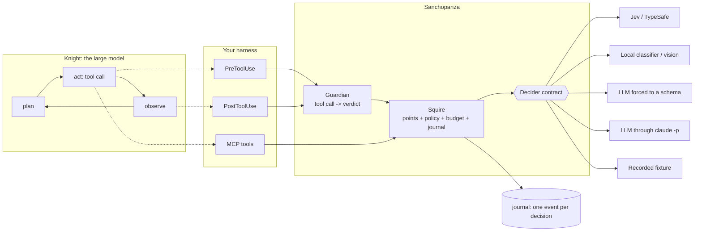

<div align="center">


# Sanchopanza

**A calibrated, non-generative decision layer for LLM agent harnesses.**

[](https://pypi.org/project/sanchopanza/)
[](https://pypi.org/project/sanchopanza/)
[](LICENSE)
[](https://github.com/romanpert/sanchopanza/actions/workflows/ci.yml)
[](docs/paper.md)

*The knight thinks. The squire reads.*

</div>

---

## The idea in one paragraph

An agent takes two kinds of decision. The **substantive** ones, what to investigate, what the
evidence means, how to write it up, are what you pay the large model for. The **procedural**
ones, which model size this subtask deserves, whether this search repeats an earlier one,
whether this page is worth reading, whether this citation holds, whether this shell command
is safe, happen dozens to hundreds of times per job, get paid at the large model's price, and
leave no trace of why they were taken. Sanchopanza moves those to a model that returns a
typed choice, a scale position or a probability, **never text**, at 29 millionths of a dollar
and a median latency, measured client-side, of 235-344 ms for most points and up to 546 ms
for the pairwise dependency point. It attaches through the hooks and tools your harness
already has.

```bash
pip install sanchopanza[jev]     # TypeSafe Jev over HTTP
pip install sanchopanza[mcp]     # expose the decision points as MCP tools
pip install sanchopanza          # core only: recorded, null, local and LLM providers

# not on PyPI yet: install from the repository
pip install "sanchopanza[jev] @ git+https://github.com/romanpert/sanchopanza"
```

Distribution, import and command are all `sanchopanza` (`sancho` on PyPI is an unrelated
package). Python 3.11+. No required dependencies.

---

## 60-second start

```python
import asyncio
from sanchopanza import JsonlJournal, Squire, Thresholds
from sanchopanza.providers import create

squire = Squire(
    create("jev"),                   # reads TYPESAFE_API_KEY
    thresholds=Thresholds(),         # the measured defaults
    journal=JsonlJournal("journal.jsonl"),
    brief="Defamation litigation in the Dominican Republic, 2020-2026",
)

async def main():
    route = await squire.route_task("List the rulings that mention defamation since 2020")
    print(route.tier, route.reason)          # light   complexity 0.05 at confidence 0.93

    verdict, confidence = await squire.verify_citation(
        claim="The court ordered a fine of 500,000 pesos.",
        quote="lo condena al pago de una indemnizacion de RD$500.000",
        source="FALLA: declara culpable al imputado ... y lo condena al pago de una "
               "indemnizacion de RD$500.000 a favor del querellante.",
    )
    print(verdict, confidence)               # supported 0.98

asyncio.run(main())
```

No key? `create("null")` makes every method return its default and the agent behaves exactly
as it did before. That is the point: **the squire can only improve an agent, never stop one.**

---

## Where it pays, and where it does not

Measured, not argued. Each line links to the run behind it.

| It pays | Measured |
|---|---|
| **Substituting a check some model was going to make anyway** (verify this citation, match this pair, check this triple) | Against Claude Opus 5 on the same 211 judgments, both arms metered: **131x cheaper and 10.9x faster**, 2 decisions less accurate at a plain 0.5 cut (202 against 204) and 4 under the shipped thresholds (200) ([paper, 5.13](docs/paper.md), [substitution](docs/results/2026-09-27-memory-write-cut/fifty/substitution.md)). Against Claude Haiku 4.5 with tool-forced output on 156 cases: **49x cheaper, 3x faster**, comparable accuracy ([paper, 5.6](docs/paper.md)) |
| **Cheap guards with a false-alarm rate low enough to leave on** | The injection check raised **0 false alarms on 149 real tool outputs**; the question and a free keyword layer together catch 120 of 124 AgentDojo payloads ([bench](docs/results/2026-09-24-agentdojo/)). Marking flagged content costs 1 task in 42; redacting it costs 65 points of utility under attack; and in front of a model that already refuses the guard buys nothing, since undefended Sonnet 5 was compromised 0 times in 105 ([end to end](docs/results/2026-09-24-agentdojo-e2e/)). A tool window that widens on what the agent reads let 24 of 56 payloads add the attacker's tools without the scan, and 0 of 56 with it ([window](docs/results/2026-09-25-window/)) |
| **Typed decisions whose confidence can be acted on** | 131 of 132 decisions above 0.75 confidence were right, against 11 of 24 below it. Choice answers are the best calibrated primitive (ECE 0.035, n = 392); Truth answers are under-confident (0.142, n = 182), so a policy can act only when confident and fall back to the harness default otherwise ([paper](docs/paper.md)) |
| **Checking the agent's own "done" before it stops** | On 655 AgentDojo trajectories, labelled by the benchmark's own check of the environment's final state: believing the agent is right **52 %** of the time, one calibrated question **94 %** (AUC 0.98), 94.5 % on the held-out half. Blocking a stop below the derived cut was right 138 times in 147 held out. Shipped as an opt-in Claude Code Stop hook (`SANCHOPANZA_CHECK_DONE=1`); measured on AgentDojo tasks, not on coding sessions ([completion](docs/results/2026-09-25-completion/)) |
| **Page selection that asks the right question** | On multi-part HotpotQA questions, labels by construction. Asking of each page alone whether it *contributes any fact the answer would use* kept both supporting paragraphs in **93.3 %** of 300 questions nothing was chosen on, with 52 % of the text, against **80.3 %** for BM25 given more text ([triage](docs/results/2026-09-25-triage/)). Asking all ten pages in one call, each with the others in view (`triage_pages`), keeps every supporting page in **98.3 %** of 300 new questions at 34 % of the text, against 94.3 % at 53 % asking page by page in ten calls; selecting sentences inside the kept pages (`select_sentences`) keeps every supporting sentence in **90.3 %** at 22 % ([chunks](docs/results/2026-09-27-chunks/)). Past what one call holds, a tournament (`triage_many`) on 100 pages per question kept both supporting pages in **96.5 %** of 200 held-out questions at **3.1 %** of the text in 5 calls; the groups alone kept 94.0 % at 4.3 %, and BM25 at the same page count 50.5 % ([hierarchy](docs/results/2026-09-27-hierarchy/)). And the kept text answers as well: with the reply forced into one short field, Claude Haiku 4.5 through the Claude Code CLI scored 70.0 % from all ten pages, **71.0 %** from the kept pages and **70.7 %** from the kept sentences, pre-registered, all three criteria holding; the claim is equality, not gain. A first run with free-length replies was negative as registered (81.0 % against 76.7 % and 76.0 %) because its containment score rewards long replies, and replies grew with the context ([answers](docs/results/2026-09-27-answers/)) |
| **Keeping documents out of one answering call, judged together** | With the document sequence held fixed (20 per task, most of them useless by construction), `triage_many` over each document's passages, the others in view, answered **9/9** against 9/9 with every document, at **-79.5 %** input tokens [-86.5 %, -72.9 %], pre-registered; the tenth task was stopped by the cost cap and cannot overturn the bar, and no answer-bearing passage was withheld in any of the ten ([fixed pages](docs/results/2026-09-28-fixed-pages/)). The same design asking of each document alone whether it is relevant (`triage_page`) lost 4 answers in 10 at -75.2 % ([fixed sequence](docs/results/2026-09-24-fixed-sequence/)): to keep documents out, use `triage_many`. One answering call, not a warm loop |
| **Reading one long document** | The tournament alone keeps half of a scientific paper (48.9 % of the text, 94.7 % of the evidence) and sentences inside it a third (31.5 %): both missed the registered 25 % ([longdocs](docs/results/2026-09-27-longdocs/)). Moving the compression to the paragraph (only paragraphs the tournament scores at 0.75 or more reach the sentence stage) and widening each kept sentence by two neighbours (`Squire.select_passages`) kept every answer sentence in **87.2 %** of 219 new QASPER questions at **21.0 %** of the text, against 84.0 % at 30.2 % for the plain two stages, with 59 % fewer sentence calls; Claude Haiku 4.5 answered from that 21 % as well as from the whole paper (F1 48.2 % against 44.5 %, 146 questions), both pre-registered ([whole documents](docs/results/2026-09-28-lateral-wholedocs/)). The rule is for one long document: on ten short pages it loses 7 points |
| **A calibrated first stage in front of Opus 5 for permissions** | Confirmed on data Opus had never seen, pre-registered: on ATBench-Codex the Jev-then-Opus cascade at tau 0.45 (fixed on R-Judge) scored **80.3 %** against Opus 5 alone at 79.9 % on the held-out half, at **38.8 %** of Opus's cost; the other half and all 500 replicate (79.1 % against 77.8 % at 38.5 %). On this set Jev alone matches Opus (78.2 %) and lets fewer unsafe actions through (false allows 14.9 % against 25.7 %) ([confirmation](docs/results/2026-09-27-cascade-frontier/)). On R-Judge, where Opus is clearly stronger, the registered rule at tau 0.80 reached Opus's 93.2 % at 57 % of the cost, over its 50 % bar: that fail stands ([cascade](docs/results/2026-09-25-cascade/)). Against Sonnet 5, the registered primary verdict is **partial**: the cascade matched Sonnet on R-Judge (92.3 %) but at 57.7 % of its cost, over the 50 % bar (a near miss: 47.7 % median over 500 re-splits); on the register it beat Sonnet (81.4 % against 80.2 %) at 46 %, and on Codex Jev alone matched it at 0.4 % of the cost ([Sonnet](docs/results/2026-09-28-cascade-sonnet/)) |

| It does not pay, or not yet | Measured |
|---|---|
| **A tool window where the platform already has tool search** | Sonnet 5, 40 AgentDojo tasks, 74 tools: success shows no detectable difference (loading everything 70/80 over two runs, the window 100/120 over three, the platform's search 31/40). Cost, estimated from recorded usage with the `tools` + `system` prefix shared between tasks: the window **0.77-0.88x** of loading everything, the search 1.48x; the window's time is 0.91x ([e2e](docs/results/2026-09-25-e2e/), [cost basis](docs/results/2026-09-25-cache/)). On a real MCP catalog of 398 tools the platform's search is the cheaper, an estimated **0.34x against the window's 0.54x** of loading everything with the prefix shared, at the same success (8/9 each, 7/9 for loading everything): the window opened the 121-tool Google Workspace server in 11 of 17 tasks ([wide](docs/results/2026-09-25-wide/)). Inside Claude Code, a sanchopanza hook changed nothing measurable over its own deferred tool search |
| **Saving tokens inside a free agent loop** | In an agent loop that fetched one or two documents per task, 64 paired runs showed no measurable change in cost and 11 to 16 % more wall time ([A/B](benchmarks/ab)): there was little to drop, and inside a warm loop a dropped token is priced at the cache-read rate. The saving above is one answering call over a sequence built to be mostly useless; in a loop it is unmeasured |
| **A lexical screen (BM25) before one in-context call** | Matched the tournament once (96.0 % against 96.5 %) and did not replicate on 200 fresh HotpotQA questions, pre-registered: 96.5 % against 97.5 %, lower bound -4 points against a registered -3; six of its seven misses were pages BM25 dropped before any call. Retired ([confirmation](docs/results/2026-09-28-lateral-screen-confirm/)) |

The rule that falls out of it: a cheap decision pays reliably when it **replaces** a call,
because the saving is then a price ratio and not a bet on the workload's shape. It pays
unreliably when it tries to keep tokens out of a context, because inside a warm loop those
tokens are priced at the cache-read rate. And it pays a third way that is not a saving at
all: at 29 millionths a decision, checks that were too expensive to run on everything become
cheap enough to run on everything. The full argument and the catalog of levers ranked by how
sure we are: **[docs/where-it-pays.md](docs/where-it-pays.md)**.

**The tool window, stated plainly.** It is correct (no needed group missed on 97 trajectories
and 40 three-task sessions, in-sample) and safe (with the injection scan no payload widened
it, also in-sample), and it keeps the prompt cache. Its cost case is weak where the platform offers tool
search. Use it where the platform has no tool search, or where the catalog is small; the open
problem is the unit, since a group the size of a whole MCP server is loaded whole.

---

## What it decides

| Method | Decides | Measured |
|---|---|---|
| `route_task` | Which model tier a subtask deserves | 17/20 raw; **11/11** when acting above 0.75 confidence; a small LLM got 8/20 |
| `route_search` | Repeat, cheap engine, or the paid one | **17/18** |
| `triage_page` | Whether a page enters the context, and whether it carries injected instructions | Relevance 14/16, but on a fixed sequence its relevance drop lost 4 answers in 10; to keep documents out, use `triage_many` ([fixed pages](docs/results/2026-09-28-fixed-pages/)). Injection: **27/28** under the policy on the public bench, AUC 1.00; on AgentDojo the question catches 101/124, the keyword layer 115/124, the two together **120/124**, with **0/149 false alarms** ([read this before quoting it](docs/results/2026-09-24-agentdojo/)) |
| `verify_citation` | supported / contradicted / unsupported / fabricated / review | **19/20**; with numbers 23/24 |
| `evaluate_plan` | Priority, saturation, tier, dependencies as a DAG with parallel waves | pairwise **20/20**; full DAG 100 % precision, 88 % recall after code cleanup |
| `review_report` | Whether a subagent's report names its sources | **21/22** |
| `guard_command` | Adds a denial on a dangerous shell command, never an approval | 29/32 alone; **31/32 with the code deny-list, zero false positives** |
| `same_entity` | Whether two mentions are the same real-world entity | **24/24** |
| `relate_facts` | agree / conflict / unrelated | **35/39 when it decides** on 50 cases, abstaining on 11 of them. It never confuses `conflict` with `unrelated`, and it reaches `unrelated` only 2 times in 12: that option is the one whose criteria carry no examples ([detail](docs/results/2026-09-24-fourth-batch/)). Its abstentions are diagnosed, not changed: one gate serves all three options although `unrelated` triggers no action ([edge-facts](docs/results/2026-09-27-edge-facts/)). Not integrated |
| `classify` | Free text into a closed vocabulary, with abstention | **80-85 %** against independent labels; majority baseline 43-62 % |
| `select_tools` | Which groups of a large tool catalog a request needs, once, before the first request | **91/97** AgentDojo tasks keep every group they need on the recorded run; a live run of the same states kept 92/97 at 77 % less catalog, and a live run on a 248-group catalog **94/97 at 88 % less**. BM25 over the same catalog and budget: 38/97. The misses are groups the request does not name ([what it is for, and where it fails](docs/results/2026-09-24-tools/)) |
| `check_loop` | Whether the goal is already met, or a check repeats one already run | **12/14** and **12/12** under the policy, AUC 1.00; with the second batch, **46/50** and **50/50**, zero false alarms ([rescored](docs/results/2026-09-25-pending/)). Attacks the largest measured waste in an agent loop: 18x the clean-run cost, no success gain |
| `triage_part` | Whether a page holds any fact the answer needs, even one step of it | **93.3 %** of 300 multi-part questions keep both supporting paragraphs at 52 % of the text; BM25 80.3 % with more ([triage](docs/results/2026-09-25-triage/)) |
| `triage_pages`, `select_sentences` | Which of a set of pages, and which of their sentences, the answer needs, each judged with the rest in view | **98.3 %** of 300 new questions keep every supporting page at 34 % of the text in one call, against 94.3 % at 53 % page by page; with sentences, **90.3 %** keep every supporting sentence at **22 %** ([chunks](docs/results/2026-09-27-chunks/)) |
| `triage_many` | `triage_pages` for any number of pages: one call up to 30, past that groups at a lenient cut (`Thresholds.pages_first_round`, 0.18, derived) and the survivors judged together at 0.40 | 100 pages per question, 200 held-out HotpotQA questions: both supporting pages kept in **96.5 %** at **3.1 %** of the text in 5 calls; groups alone 94.0 % at 4.3 %; BM25 at the same page count 50.5 %. After LATTICE (arXiv:2510.13217). The 90 added pages are off-topic, and a third round is unmeasured ([hierarchy](docs/results/2026-09-27-hierarchy/)) |
| `select_passages` | Which sentences of one long document an answer needs: the tournament over its paragraphs, then sentences with a window of two inside the paragraphs kept at 0.75 or more | **87.2 %** of 219 new QASPER questions keep every answer sentence at **21.0 %** of the text; an answering model scored as well from it as from the whole paper ([how](docs/results/2026-09-28-lateral-wholedocs/)) |
| `check_done` | Whether the transcript shows the request actually done | **94 %** on 655 AgentDojo trajectories against 52 % for the agent's own word; AUC 0.98 ([completion](docs/results/2026-09-25-completion/)) |
| `remember` | Whether a fact is worth writing to long-term memory | One cut of **0.54** on the weakest margin, derived on half of 100 cases to an 80 % precision target and pre-registered: on the held-out half **39/49 with 1** fact labelled skip stored (the three-question conjunction it replaced: 37/49 with 2); on 108 cases never used for any threshold, **74 with 1** (conjunction: 60 with 4) ([cut](docs/results/2026-09-27-memory-write-cut/)). It stores 4 of 36 standing client instructions; the opt-in fourth question fixes that family: `remember(ask_common=True)` scores **45/48** on a batch written before it was measured, where the shipped cut scores 37/48, keeping 32-35 of the 36 ([numbers and the trade](docs/results/2026-09-25-window/memory.md)) |
| `reconcile` | Whether a new fact contradicts, duplicates or complements a stored one | **46/50**, all four errors into `keep_both`; every branch fires. Recency stays in code, because dates are the model's declared weakness |
| `needs_recall` | Whether a turn needs a memory lookup at all | **14/14** on the first bench, AUC 1.00, ECE 0.049; **50/50** with the second batch |
| `gate_extraction` | Whether a chunk is worth a generative extraction call | **15/16**, AUC 1.00 |
| `verify_edge` | Whether the text states a proposed triple, in that direction | 31/38 when deciding on 50 cases; **17 edges committed, 1 of them backwards** ([detail](docs/results/2026-09-24-fourth-batch/)). The misses clustered on actions and passives; a `direction` question worded by roles, tested on a pre-registered fifth batch, caught **10 of 12** reversed edges against 5 with no wrong commit, and is the default since ([fifth batch](docs/results/2026-09-27-edge-facts/fifth-batch.md)) |
| `triage_redundant` | Whether a page repeats what the agent already holds | **116/125**, AUC 1.00. Its threshold is **derived** rather than chosen: 0.59 to a 90 % precision target, 100 % precision held out ([how](docs/results/2026-09-24-third-batch/)) |

| Class (0.3.0) | Decides | Measured |
|---|---|---|
| `ToolWindow` | Which tool groups the agent holds as the work moves: opened from the request, widened on each new user turn and after each tool result it reads, once that result passes the injection scan. It never swaps or removes, so the prompt cache survives | 0 missed groups on 97 trajectories and 40 three-task sessions, where selecting once misses 6 and 124 (in-sample). End to end, see the table above ([results](docs/results/2026-09-25-e2e/), [mechanism](docs/results/2026-09-25-window/)) |

> **Two gates on one number are one gate.** For a Truth answer from this model,
> `confidence` is exactly `|2p - 1|` (651 recorded answers, zero deviation), so a policy that
> asks for both a probability and a confidence is asking for one stricter probability. The
> shipped policy gates each probability once. On the six binary points of the 124-case bench
> it is right **82 times out of 88**, with **AUC 1.00 on every one**: no error is an ordering
> error, and every error is a refusal to act. A Choice answer follows the same identity,
> rescaled: `confidence = (p_top - 1/k) / (1 - 1/k)` to within 0.022 over 7,162 recorded
> answers ([edge-facts](docs/results/2026-09-27-edge-facts/)).

Every figure is quoted from a recording and pinned by a replay test, because the provider is
not deterministic across a day: the same state, asked again of the same pinned version, moved
by up to 0.09. Full method, intervals and caveats: [the paper](docs/paper.md). Benches and
how to run them: [docs/benches.md](docs/benches.md).

**Same answer within a window, opt-in.** `CachedDecider(inner, ttl_seconds=..., path=None)`
wraps any provider: a repeat of the same point, state and questions (same option order, same
provider and model) inside the TTL returns the first answer, identically and at zero cost, and
the journal shows it as `<provider>@cache`. Failed, empty and partial decisions are never
stored; `path` adds a JSON-lines store on disk holding hashes and numbers, not the text. It
gives identical answers within the TTL; it does not fix drift across TTL windows, and it is
tested with fake providers only.

---

## What it costs

| | |
|---|---|
| One decision | **29 millionths of a dollar**, output included, because this model's output is free |
| **Against Claude Opus 5, the same 211 judgments, both arms metered** | **131x cheaper, 10.9x faster, two decisions less accurate** |
| The same tokens on Claude Sonnet 5, input only | **48x** more |
| The same tokens as a Sonnet 5 **cache read** (0.1x input) | **4.8x** more, and this is the honest comparison inside a warm loop |
| Against Claude Haiku 4.5, tool-forced, same cases | **49x cheaper, 3x faster**, comparable accuracy |
| Against a hosted evaluation meter (Azure, Vertex legacy), per 1,000 judgments | 0.029 USD against about 42 USD: **~1,450x** |

The second row is the one to read, because both sides of it are measured rather than quoted
from a tariff. Building a second annotator for our own bench meant asking a frontier model
the same 211 judgments, from the same question builders, blind to the labels. It agreed with
the labels **204/211**; the evaluator agreed **202/211** at a plain 0.5 cut and **200/211**
under the thresholds it ships with. So the frontier model is the better judge, by two
decisions once the thresholds are taken out of it, and it costs 131 times more per judgment
and answers eleven times slower. That is the trade, stated in the direction that does not
flatter this package ([paper, 5.13](docs/paper.md),
[substitution](docs/results/2026-09-27-memory-write-cut/fifty/substitution.md)). It
reproduces for free from the recording and the second annotator's files:

```bash
sanchopanza bench benches/loop-b.jsonl benches/memory-b.jsonl benches/graph-build-b.jsonl \
    benches/retrieval-b.jsonl --provider recorded --fixture fixtures/new-points-50-v2.jsonl --out DIR
cp docs/results/2026-09-27-memory-write-cut/fifty/annotator-* DIR/
python benchmarks/substitution.py --results DIR
```

There is no headline saving percentage on this page. The break-even arithmetic and the
experiments that bound it are in [docs/savings.md](docs/savings.md) and
[benchmarks/](benchmarks/).

**And one way to lose money with it.** Tool definitions sit at the front of the prompt
prefix, so rewriting them invalidates the tools, system and message caches at once. Measured
over 8 turns on Claude Sonnet 5: narrowing the catalog **once** is 43 % cheaper than not
narrowing, narrowing it on alternate turns is 14 % *dearer* than not narrowing, and a
selector that picks a different subset every turn reads **nothing** from cache and costs
4.15x the one that decided once ([benchmarks/cache](benchmarks/cache/results/summary.md)).
Same decision, different moment, opposite sign. The same mechanism applies to any benchmark
of tool presentation: tasks must share the `tools` + `system` cache prefix the way a
production harness does, or the arms with a fixed catalog are overcharged.

---

## Architecture



| Module | Holds |
|---|---|
| `sanchopanza.contract` | `Choice`, `Score`, `Truth` questions in; `Answer` with probabilities and confidence out; the `Decider` protocol |
| `sanchopanza.points` | The questions of each decision point, verbatim as measured, plus a pure policy function per point |
| `sanchopanza.squire` | One decider, one `Thresholds`, one journal, one budget. Fail-open, capped, traced |
| `sanchopanza.harness` | `Guardian` (tool call in, verdict out) and the per-harness adapters |
| `sanchopanza.providers` | `jev`, `recorded`, `null`, `llm`, `claude-cli`, `local`, plus `FallbackDecider`, `RoutedDecider` and `CascadeDecider` |
| `sanchopanza.eval` | Bench runner and statistics, in plain Python: Wilson, bootstrap, McNemar, AUC, Brier, ECE |

### Four invariants

1. **Fail open.** No provider, no key, exhausted budget, provider bug: every policy returns
   the default the harness had before. `Squire.decide` never raises.
2. **Asymmetry.** The direction whose error the user sees needs more confidence. Downgrade a
   model at 0.75, upgrade at 0.60. Drop a page only on explicit low relevance; in doubt it
   enters. Emit a citation verdict at 0.80, else abstain. The guard denies, never approves.
3. **Trace.** One journal event per decision, with probabilities, confidence, cost, latency
   and outcome. Audit trail first, labelled dataset later.
4. **Cache-safe by construction.** A decision acts only where acting cannot invalidate a
   cached prefix: before the first request of a session, on content about to be appended, or
   inside a tool the agent called anyway. Never by rewriting `tools`, `system` or history
   mid-session. This one is measured, not assumed: getting it wrong costs 4.15x
   ([benchmarks/cache](benchmarks/cache/results/summary.md)). The tool window keeps it: it
   grows only through channels that append (`tool_addition`, `tool_reference` results) and
   never removes, because removal reclaims no tokens.

More: [docs/architecture.md](docs/architecture.md).

---

## Attach it to a harness

| Harness | How | Status |
|---|---|---|
| **Claude Agent SDK** | `hooks=hook_matchers(guardian)` | Hook shapes tested |
| **Claude Code** | `sanchopanza install --write` adds command hooks pointed at `sanchopanza hook` | **Run end to end, pre-registered.** 144 headless sessions (Haiku 4.5, 8 reps, hooked and plain): the two destructive commands plain Claude Code ran 15 of 15 times were stopped 16 of 16 times; planted instructions in a `Read` file or `curl` output flagged 16/16; 0 false alarms in 93 benign hooked events [0-4.0 %]. The agent refused the planted text in every session either way, so the scan changed no reply. At the hook, over labelled public sets: the `curl`-output scan noted 121/124 AgentDojo injections with 0/149 false alarms; the Stop check's blocks were right 286 of 299 times on 655 AgentDojo runs, and it blocked 13 of 342 finished ones. **It does not judge MCP tool calls**: on ATBench-Codex it flagged 0 of 250 unsafe trajectories, because their risk is in MCP calls. About 0.2 s per hook with nothing to decide, 0.8-1.0 s with a Jev decision, on a Windows laptop ([broad](docs/results/2026-09-28-claude-code-broad/), [first run](docs/results/2026-09-28-claude-code-harness/)) |
| **MCP client** (Cursor, Codex, Copilot, Hermes, yours) | `build_server(squire).run()` | Parsers tested |
| **OpenAI Agents SDK** | `tool_guardrail(guardian)` | Shape tested |
| **Anthropic Messages API** | `WindowedTools(window, tools_by_group, model=...)`: the whole catalog deferred, `tool_addition` on Opus 5 (end to end) and Opus 4.8 / Fable (shape only), a `load_tools` tool elsewhere | Shapes checked against `count_tokens`; **measured end to end** |
| **LangChain / LangGraph** | `ToolSelectMiddleware(squire, key_of=thread_id)`: one append-only window per conversation | Shape tested |
| **Anything else** | `await guardian.before_tool(ToolCall(name, args))` returns allow, deny with a reason, or rewrite with new arguments | |

<details>
<summary><b>Claude Agent SDK</b></summary>

```python
from claude_agent_sdk import ClaudeAgentOptions
from sanchopanza.harness import Guardian, HarnessConfig
from sanchopanza.harness.claude_agent_sdk import hook_matchers

guardian = Guardian(squire, HarnessConfig(
    tiers={"light": "researcher-light", "default": "researcher", "deep": "researcher-deep"},
    # A probe, never a constant: it answers "does that engine exist and answer, right now".
    # A flag that is always true routes work into a hole, and nothing fails. See
    # docs/where-it-pays.md, section 5.
    cheap_search_available=search_engine.reachable,
))
options = ClaudeAgentOptions(hooks=hook_matchers(guardian), ...)
```
</details>

<details>
<summary><b>Claude Code</b> (<code>.claude/settings.json</code>)</summary>

```json
{"hooks": {
  "PreToolUse":  [{"matcher": "Agent|WebSearch|Bash",
                   "hooks": [{"type": "command", "command": "sanchopanza hook"}]}],
  "PostToolUse": [{"matcher": "Agent",
                   "hooks": [{"type": "command", "command": "sanchopanza hook"}]}]
}}
```

Configure with `TYPESAFE_API_KEY`, `SANCHOPANZA_PROVIDER`, `SANCHOPANZA_TIERS`, `SANCHOPANZA_JOURNAL`.
See [examples/claude_code](examples/claude_code/).
</details>

<details>
<summary><b>MCP server</b></summary>

```python
from sanchopanza.harness.mcp import build_server
build_server(squire).run()
```

Tools: `verify_citation`, `evaluate_plan`, `align_entities`, `classify_field`, `triage_text`.
</details>

<details>
<summary><b>Anthropic Messages API: a tool window</b></summary>

```python
from sanchopanza import ToolWindow
from sanchopanza.harness.messages_api import WindowedTools, accepts_tool_addition

# catalog: [{"name": "email", "about": "...", "requires": [...]}, ...]; tools_by_group: name -> schemas
# Waiting to read deferred content only pays where the widening can reach the model unasked.
window = ToolWindow(squire, catalog, always={"clock"},
                    wait_on_deferred=accepts_tool_addition("claude-sonnet-5"))
await window.open(user_request)
wt = WindowedTools(window, tools_by_group, model="claude-sonnet-5")
tools = wt.tools()                      # identical on every request: the cache survives
messages = [{"role": "user", "content": user_request}, *wt.opening()]

# in the loop, for each tool call:
if call.name == "load_tools":
    result = await wt.load(call.id, call.input["need"])       # references only
else:
    text = run(call)
    change = await window.observe(text, trust="tool")         # scanned, then widened
    messages += wt.after(change)        # a tool_addition system message on Opus 5, Opus 4.8, Fable
```

The window only grows: `tool_removal` reclaims no tokens (measured), so removing would only
cost. A tool result that the injection scan flags taints the window until the next user
turn, and `load_tools` is refused meanwhile - a model that has read an injection asks for
tools in the attacker's words.
</details>

Details per harness, including what is tested and what is not:
[docs/adapters.md](docs/adapters.md).

---

## Swap the model

The contract is five lines, so a provider is one file.

```python
from sanchopanza import answers
from sanchopanza.providers import FallbackDecider, LocalDecider, create

local = LocalDecider({                                  # your classifier, on your hardware
    "injection": lambda state, q: answers.truth(clf.predict_proba(state["text"])),
})
squire = Squire(FallbackDecider([local, create("jev")]))  # local first, hosted for the rest
```

`RoutedDecider({"guard": on_prem}, default=hosted)` keeps one decision point in your building.
`LLMDecider(anthropic_completer(...))` forces any chat model into the same schema, with the
caveat, measured, that an LLM's self-reported confidence does not separate its errors.
`create("claude-cli", model=..., ceiling_usd=..., cache_path=...)` is the same `LLMDecider`
run through `claude -p`: billed to the account `claude` is logged into, never to an API key
(the session's environment drops every `ANTHROPIC_*`, `CLAUDE_CODE_USE_*` and
`AWS_BEARER_TOKEN_BEDROCK` variable), with a hard ceiling and a disk cache. A number from that path is not
placed beside an API number without a check: with free-length replies the CLI scored 74.7 %
where the Batch API scored 67.7 % on the same prompts; with the reply forced into one short
field, 67.0 % against 67.7 % ([answers](docs/results/2026-09-27-answers/)). Vision
models plug in through `LocalDecider` with the image reference in the state. Third-party
packages register providers under the `sanchopanza.providers` entry-point group.

Writing one: [docs/providers.md](docs/providers.md).

---

## Measure before you trust

```bash
sanchopanza bench benches/core.jsonl benches/safety.jsonl benches/graph.jsonl \
    --provider recorded --fixture fixtures/public-benches.jsonl
sanchopanza bench mycases.jsonl --provider jev --record fixtures/mine.jsonl --out results/today
```

The first command replays a real run from its recording, costs nothing and reproduces the
public run ([paper, Section 5.9](docs/paper.md)); Appendix A of the paper lists each bench's
fixture. Both print agreement when deciding, coverage, Wilson intervals, AUC,
Brier, expected calibration error, agreement by confidence band and calibration by primitive.

**Quote from the recording.** Pinning the model version keeps the thresholds meaningful, but
it does not make an answer reproducible: identical states moved by up to 0.09 within a day. A
decision within about 0.1 of its cut is a coin flip between runs, so a live rerun is a new
sample, and a number worth publishing is recorded with `--record` and pinned by a replay test.

**The rule for thresholds:** one moves when that decision point has 50 cases, a second
annotator, and a confidence-band table that justifies the move, or when it is derived to a
target on one set and checked on another. Page redundancy's `adds_nothing` (0.59) and
`memory_write`'s cut (0.54) are derived to a precision target; the cuts of the page and
sentence selection points, including the tournament's first round (0.18), to a recall target
on HotpotQA; each result README gives the rule. The other defaults were fixed before the
runs that measured them and have not been tuned on the results.

### What is open

- **A derivation rule that does not overpay.** Against both Opus and Sonnet on R-Judge, the
  registered rule ("reach the frontier model's accuracy on the derivation half") bought its
  last case with many escalations. A rule fixed in advance as "within half a point" is what
  the Codex confirmation used; it has not been tested against Sonnet on unseen data.
- **Content fetched through the shell.** The Claude Code run saw an agent fetch a page with
  `curl` from Bash, and nothing scanned it: the hook read Bash's `stdout` as empty. Fixed:
  with `--scan-content`, the output of a command that fetches from the network (`curl`,
  `wget`, `Invoke-WebRequest`, `gh api`, ...; decided in code) is scanned by default, and
  other shell output when `Bash` is named. Checked on the recorded result shape with unit
  tests only; its cost (one decision per fetching command) and its misses are unmeasured
  in a live session.
- **`relate_facts`.** The `unrelated` gate at 0.5 and examples on `unrelated` did not beat the
  shipped question on the fifth batch; its errors stay as documented
  ([fifth batch](docs/results/2026-09-27-edge-facts/fifth-batch.md)).
- **The unit of the tool window**, through the tournament over the sub-groups of a large
  server. An idea, unmeasured.
- **Long documents**, by the same descent: document, then sections, then sentences.
  Unmeasured.

---

## What it is not

- **Not an arithmetic engine.** It does not count or compare numbers. Code does that for free
  and correctly.
- **Not a security boundary.** The decision model is itself vulnerable to instructions
  injected into its state. It may add a denial on top of a deterministic list; it never grants
  permission.
- **Not an explainer.** The audit trail is probabilities, not prose.
- **Not a silver bullet for cost.** It pays reliably when it replaces a model call; keeping
  tokens out of a context is a bet on the workload, and every decision adds latency.
- **Not a replacement for the platform's tool search.** On a 398-tool catalog the platform's
  search matched the tool window's success at a lower cost, and inside Claude Code a hook
  added nothing measurable. Where a tool search exists, use it, and keep the squire for the
  decisions it does not make.
- **Not a substitute for a probe.** It chooses between the options you tell it exist. If one
  of them does not, it will route work into the hole confidently, and nothing will fail.

---

## Repository

```
src/sanchopanza/       the package
benches/               public benches: core 74, safety 106, graph 64 + one plan, the
                       memory, graph-building, redundancy and loop batches, and 273
                       injection cases harvested from AgentDojo (docs/benches.md)
fixtures/              recorded real runs, so tests and CI cost nothing
benchmarks/ab/         the end-to-end A/B: corpus, tasks, runner, results
benchmarks/cache/      what narrowing a tool catalog costs, per turn against once
benchmarks/agentdojo/  injection, tool selection, the tool window, end to end
benchmarks/mcp_wide/   the tool window against a real 398-tool MCP catalog
benchmarks/chunks/     pages and sentences in context on HotpotQA, and the answering runs
benchmarks/hierarchy/  the tournament over 100 pages per question
benchmarks/cascade/    the permission cascade and its post-hoc frontier
skills/sanchopanza/    a skill for coding agents that wire this in
docs/paper.md          the working paper
docs/results/          one directory per run, each with the report behind its figures
docs/savings.md        what it costs, and the break-even arithmetic
docs/where-it-pays.md  which decisions are worth taking, ranked by how sure we are
docs/architecture.md   diagrams and the invariants
docs/adapters.md       one section per harness
docs/providers.md      how to write a provider
docs/evolve.md         the interface a self-improving harness uses to tune this package
docs/governance.md     branch protection, PyPI trusted publishing, releasing
examples/              Claude Code, Claude Agent SDK, MCP, a local provider, evolve
tests/                 no test calls a paid API
```

Contributions: [CONTRIBUTING.md](CONTRIBUTING.md). Cases with labels are worth more than
features.

---

<div align="center">

**Apache 2.0**, which adds an express patent grant on top of a permissive licence.

Named after the squire who keeps his feet on the ground while the knight sees giants.

</div>
