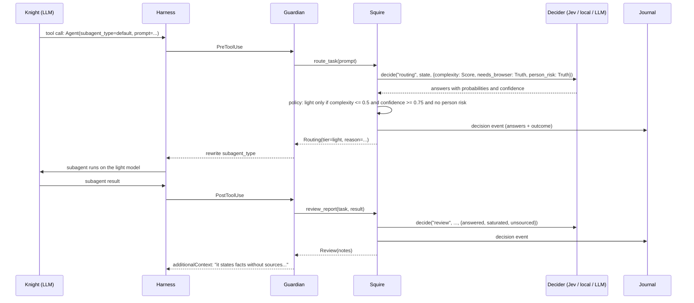
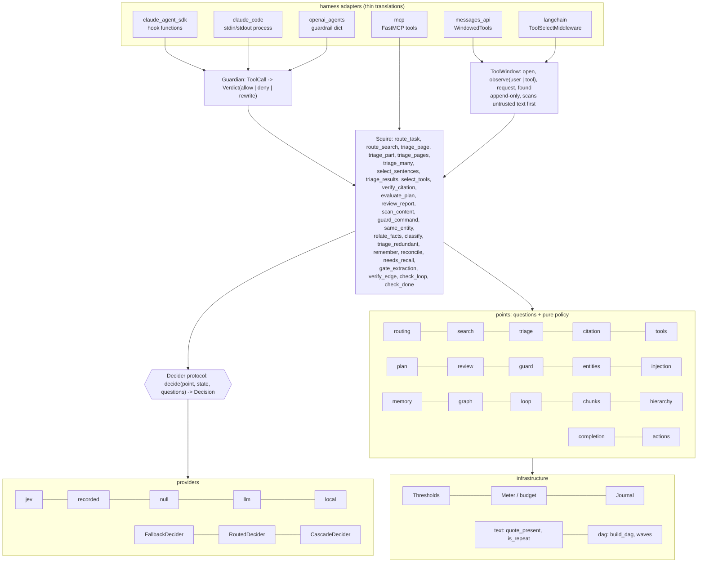

# Architecture

sanchopanza is a decision layer between an agent harness and a decision model. It owns nothing
of the agent loop. It observes tool calls and tool results through the extension points the
harness already has, asks closed questions about them, and turns calibrated probabilities
into three kinds of effect: rewrite an argument, deny with a reason, or append a note.

## The loop with an evaluator of another family

The classic ReAct loop is *think, act, observe* with one model in all three phases. sanchopanza
splits *observe* in two: the large model still reads what comes back, but a model of another
family, without the ability to generate and therefore without the ability to self-confirm,
emits typed signals first, about what came back (exhausted, unsourced, off-target) and about
what is about to happen (complexity, redundancy, danger).

## Layers

Dependencies point downwards only. Points import the contract, the policy and text helpers.
The squire imports points. The tool window imports the squire and two points (`tools`,
`injection`). Adapters import the squire or the window. Providers import the contract and
nothing else. Swapping a provider touches one file; adding a harness touches one file.

**The tool window (0.3.0).** `select_tools` decides once, from the request, which is right
while the only way to change a tool set is to rewrite `tools`. `ToolWindow` follows the
session instead: it opens narrow, widens on a new user turn and after a tool result that has
passed the injection scan, and never removes anything. `WindowedTools` renders it into the
Messages API with the whole catalog deferred and `tools` byte-identical for the session;
groups surface through `tool_addition` on Opus 5 (measured end to end) and on Opus 4.8 and
Fable 5 and 5.1 (shape accepted by `count_tokens`, not run end to end), and through a
`load_tools` tool answered with references-only results on Sonnet 5 and Haiku 4.5, where
the window must open with `wait_on_deferred=False`. Channel measurements:
`docs/results/2026-09-25-window/README.md`, section 1; the rule and the end-to-end run:
`docs/results/2026-09-25-e2e/README.md`; the adapter in detail: `docs/adapters.md`.

A window's cost is set by its coarsest group, because an opened group is loaded whole. On a
real 398-tool MCP catalog grouped by server, the window opened a 121-tool server in 11 of 17
tasks and cost more than the platform's own tool search, which loads by tool
(`docs/results/2026-09-25-wide/`). The unit of loading, not the per-group judgment, is the
open design question.

**Sets larger than one call: a tournament.** `triage_pages` asks one Truth per page with every
page in the same state, so each page is judged among its rivals; one call holds 30 pages
(`chunks.PAGE_MAX`) and Jev's 32k-token state. `Squire.triage_many` keeps that shape past the
cap (`points/hierarchy.py`): balanced groups judged at a lenient first-round cut
(`Thresholds.pages_first_round`, 0.18, derived), then the survivors judged together at
`pages_in_context` (0.40). The hierarchy is free, the order the pages came in, and no model
writes a summary; the idea is LATTICE's (arXiv:2510.13217). On 100 pages per question it kept
both supporting pages in 96.5 % of 200 held-out HotpotQA questions at 3.1 % of the text in 5
calls (`docs/results/2026-09-27-hierarchy/`). `hierarchy.MAX_ROUNDS` allows a third round,
which is unmeasured.

## Invariants

**Fail-open.** `Squire.decide` never raises. A missing key, an exhausted budget, a network
error, a provider bug: every one becomes a `Decision` with `error` set and no answers, and
every policy maps that to the default the harness had before sanchopanza existed. The squire can
make an agent cheaper or safer; it cannot make it stop.

Fail-open covers a missing *decision*. A missing *answer* inside a decision is a different
case: `probability(answer)` returns 0.0 for an answer that does not exist, so an absent "is
this about a person?" would read as a confident no, and an absent direction as a confident
yes. Every policy therefore checks `.empty` before reading a probability whenever the default
would push the decision in the costly direction, and a NaN, infinite or out-of-range value is
an empty answer at the contract boundary (`docs/results/2026-09-25-window/audit.md`). The
same rule holds for any new point.

**Asymmetry.** The costly direction needs more confidence than the cheap one.

| Decision | Costly direction | Threshold | Cheap direction | Threshold |
|---|---|---|---|---|
| Model per subtask | downgrade to light | `act` = 0.75 | upgrade to deep | `relax` = 0.60, and only if allowed |
| Page triage | drop | relevance < 0.45 or injection > 0.70 | keep | anything else, including no data |
| Citation | emit a verdict | `citation` = 0.80 | send to review | below |
| Shell guard | add a denial | `guard` = 0.70 | leave the code list's answer | always |
| Entity alignment | merge or split | outside [0.25, 0.75] | say "not sure" | inside |
| Classification | accept a label | `classify` = 0.60 | leave null | below, or `other` wins |
| Tool window, after a tool result | widen on text the user did not write | only after the injection scan read all of it and passed it | add nothing | a flagged or incomplete scan; the window then refuses `load_tools` until the next user turn |

The direction follows the cost of the error the operator sees. A router with a bias towards
the cheap model costs quality the client notices; a router that keeps the default costs
cents nobody notices.

**Code before model.** A literal quote match, token overlap between queries, a regex
deny-list, the transitive reduction of a graph: all deterministic, all free, all before any
call. The model covers only what code cannot: synonyms, meaning, indirect danger, pairwise
dependency.

**Trace.** Every decision is one journal event with the raw answers (probabilities,
confidence), cost, latency, provider, model, error, and the policy outcome. It is the audit
trail for "why did this subtask run on the small model" and the labelled set for tuning
thresholds later. Sample it, re-label it, compare.

**Budget.** Decisions and dollars per job. At the cap, defaults and one warning.

**Cache-safe by construction.** This invariant is measured, not assumed. Anthropic's prompt
cache matches on a prefix rendered in the order
`tools -> system -> messages`, and a change at any level invalidates that level and every
one after it. So a decision that *acts* by rewriting the tool array, editing the system
prompt or rewriting earlier turns does not merely fail to save: it turns every cached read
left in the conversation into a fresh write at 1.25x.

The squire therefore acts only at points where there is no prefix to invalidate:

| Where it acts | Why that is safe |
|---|---|
| Before the first request of a session (tool catalog, tiers) | There is no prefix yet |
| On content about to be appended (a fetched page, a search result, a subagent's prompt) | Appending is what the conversation does anyway |
| Inside a tool the agent called (citation, entities, classification, edges) | The tool's result is one more appended block |
| On a *delegation*, choosing the subagent's model | A subagent does not read the parent's cache in any case |
| As a note, through `additionalContext` | A note is appended, not spliced |
| Widening a tool window, through `tool_addition` or a `tool_result` of `tool_reference` blocks | The catalog is declared once, deferred, and never changes; a surfaced schema is appended where it is surfaced |

And never by mutating `tools`, `system` or history mid-session. Nor by removing a tool:
`tool_removal` reclaims no tokens (+26 measured with `count_tokens`, the removal block
itself, because the schema stays in the history where it was added), so removal is a
control and never a saving, and the window is append-only
(`docs/results/2026-09-25-window/README.md`, section 1). Measured over 8 turns on
claude-sonnet-5 (`benchmarks/cache/`): narrowing a 58-tool catalog once is 43 % cheaper than
not narrowing; narrowing it on alternate turns is 14 % *dearer* than not narrowing; and
picking a different subset every turn reads **zero** tokens from cache across the whole
conversation and costs 4.15x the arm that decided once.

The general form of the rule is not ours. Meta reported that moving the same static analysis,
with the same false-positive rate, from batch to diff time took its fix rate from near zero
to over 70 % (CACM 62(8), 2019). Where a decision lands matters more than how good it is.

## Where the squire does not go

- Arithmetic, dates, magnitude comparisons: the model class reads numbers as text.
- Any action where the decision model would be the only barrier. Its own model card declares
  it vulnerable to instructions injected in its state. In the shell guard it can only deny;
  in page triage the cost of a wrong answer is a token.
- Widening what an agent can do on the strength of what it read, unscanned. A window that
  widens on tool results hands its bound to whoever wrote them: without the injection scan
  24 of 56 AgentDojo payloads got the window to add the group the attacker needed; with it
  none did, and no clean text lost an addition. The detector was fitted on the same injection
  bench, so that efficacy is in-sample (`docs/results/2026-09-25-window/README.md`, section 5).
- Anything that needs a written explanation. The audit is numbers.

## Calibration by primitive

From the 712 non-repeated decisions of the September 2026 runs (docs/paper.md, 5.8):

| Primitive | n | Agreement | Mean declared confidence | ECE | Reading |
|---|---|---|---|---|---|
| Choice | 392 | 85 % | 0.86 | 0.035 | well calibrated |
| Truth | 182 | 91 % | 0.76 | 0.142 | under-confident: the model is better than it says |
| Truth + Score (routing) | 50 | 76 % | 0.75 | 0.131 | the weakest point, and the only one on a Score |

This is why `Thresholds` has separate knobs rather than one global confidence: a Truth answer
at 0.62 is right about 83 % of the time on the dependency point, and a Score at 0.75 on the
routing point is not. Per-point thresholds were fixed before the runs and have not been
re-tuned on these numbers, except where one was derived to a stated target on one set and
judged on another: `adds_nothing` (0.59), the `memory_write` cut (0.54) and the HotpotQA
selection cuts (`docs/benches.md`, "The rule"). The rule: 50 cases per point and a second
annotator first.

For a Truth answer `confidence = |2p - 1|`, and for a Choice answer over k options
`confidence = (p_top - 1/k) / (1 - 1/k)` to within 0.022 across 7,162 recorded answers
(`docs/results/2026-09-27-edge-facts/`). In both cases the confidence is the probability
rescaled, so a policy gates each answer on one number.

**The provider is not deterministic across a day.** The same states asked again of the same
pinned `jev-1.13.0` moved by up to 0.09 within a day (`docs/results/2026-09-25-window/`,
section 7). Pinning the version keeps the thresholds meaningful; only a recording makes a
number reproducible, which is why every figure in this repository is quoted from a recording
and pinned by a replay test. A decision within about 0.1 of its cut is a coin flip between
runs, and a published count should say how many of its decisions sit that close.
Inside a job, `providers.CachedDecider` makes a repeat of the same question within a TTL an
exact, unpaid repeat; across TTL windows, and across processes that do not share its store,
the drift remains.

ECE is reported with its limits: at these sample sizes the estimator's own bias is about
0.083 (n = 180), so a difference between two ECE values here says less than the decimals
suggest. The direction of each reading holds; the decimals do not.
