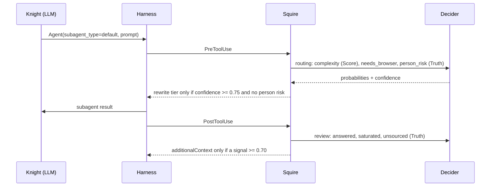
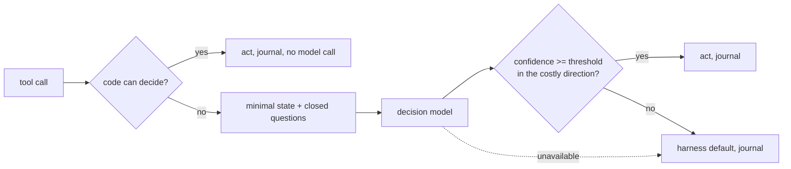
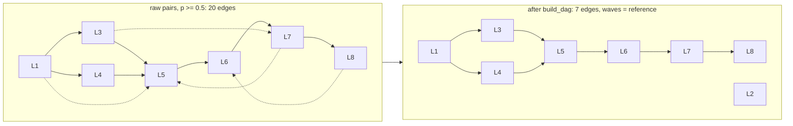

# Sancho: A Calibrated, Non-Generative Evaluator for LLM Agent Harnesses

**Working paper · version 0.3.0 · 2026-09-27**
Status: results on small benchmarks, mostly single-annotator, one of them with a second blind
annotator. Written to be checked, not believed. Every public number is recomputable for free:
it is quoted from a recording of the provider's answers, replayed with
`sanchopanza.eval.stats`, and pinned by a test that fails if it moves. The private runs are
described in Appendix A; the public ones live in `benches/`, `fixtures/` and `docs/results/`
of this repository.

---

## Abstract

Agents built on the *think, act, observe* loop use one large language model (LLM) for two
very different kinds of decision. Substantive decisions (what to investigate, what the
evidence means, how to write it up) are what the model is paid for. Procedural decisions
(which model size a subtask deserves, whether a search repeats an earlier one, whether a
fetched page is worth reading, whether a citation supports a claim, whether a shell command
is safe, which tools the agent should see) occur dozens to hundreds of times per task, are
paid at the large model's price, and leave no trace of why they were taken. We move them to a
**heterogeneous evaluator**: a *System One* decision model that returns a typed choice, a
scale position or a probability, never text, attached to the loop through the harness's
existing hooks and tools. Because it belongs to another model family and cannot generate, it
cannot self-confirm; because it returns calibrated probabilities, code can abstain or fall
back to a default when confidence is low.

On 180 hand-labelled cases in Spanish from two real investigations, plus 298 register
entries with independently produced labels, the evaluator (Jev 1.13, TypeSafe) detects
prompt injection on every case of its own bench at a plain 0.5 cut (AUC 1.00), and on 27 of
28 under the shipped policy, which flags only above 0.70. It reaches 95 % on citation support
(19/20), 96 % on numeric citation checks (23/24), 95 % on unsourced-claim detection (21/22),
94 % on search routing (17/18) and 91 % on dangerous-command detection (29/32); stacked on a
deterministic deny-list it reaches 31/32 with zero false positives. It aligns entity mentions
perfectly on 24 hard pairs, judges pairwise plan dependencies perfectly on 20 pairs and, once
code breaks cycles and removes transitive edges, reconstructs the DAG of an 8-line plan with
100 % precision, 88 % recall and the exact parallel waves; on closed-vocabulary
classification against independent labels it reaches 80-85 % over majority baselines of
43-62 %. Against a small LLM (Claude Haiku 4.5, tool-forced output) it is 49 times cheaper
and three times faster with comparable accuracy, and markedly better at rating task
complexity (17/20 against 8/20). Against a frontier model (Claude Opus 5) asked the same 211
questions it agrees with the labels 202 times at a plain cut against 204, at 131x lower cost
per judgment.

The central result is **separation by confidence**: 131 of 132 decisions at confidence
>= 0.75 were right against 11 of 24 below; 13 of the evaluator's 14 errors carried confidence
below 0.75, whereas 9 of the LLM's 17 errors carried self-reported confidence >= 0.75.
Calibration differs by primitive: Truth answers are under-confident (ECE 0.14 on 182
decisions), Choice answers are well calibrated (ECE 0.035 on 392), and the Score primitive is
the least reliable. These properties are what let an asymmetric policy (act only when
confident, otherwise keep the default) make the agent no worse than without the evaluator.
Answers are identical across five repetitions within a session, but the same pinned version
moves by up to 0.09 on identical input within a day; that is why every number here is quoted
from a recording.

The same contract drives a **tool window** that opens narrow and only grows, through API
channels that append and never invalidate the cached prefix. Offline on 97 AgentDojo
trajectories it misses no needed tool group where selecting once misses 6, and none across
40 three-task sessions where selecting once misses 124; its injection scan cuts the attacks
that widen it from 24 of 56 to 0 of 56. Both results are in-sample. End to end with Claude
Sonnet 5 on 40 tasks and a 74-tool catalog it completes 100 of 120 tasks pooled over three
runs against 70 of 80 with every tool loaded, no detectable difference at this n, at 0.91x
the time and an estimated 0.77-0.88x the cost once the catalog's cache prefix is shared
between tasks. On a 398-tool catalog of real MCP servers the platform's own tool search is
cheaper still (an estimated 0.34x of loading everything, against the window's 0.54x) at
equal success, and inside Claude Code a window hook changes nothing measurable. The window is
correct and safe; where the platform already offers tool search its cost case is weak, and
its unit, a server-sized group, is the open problem.

Where the layer pays is **substitution**: replacing a judgment some model was going to make
anyway, at a price ratio that does not depend on the workload. Where it does not is
**avoidance** bought by dropping content: with the fetch sequence held fixed, page triage
cuts input tokens by 75 % and correctness from 10/10 to 6/10, and those are one result. Asked
whether each page contributes a fact the answer needs, with the other pages in view, the
evaluator keeps every supporting page of 98.3 % of new HotpotQA questions at a third of the
text, and a tournament of such calls keeps both in 96.5 % among 100 pages at 3.1 % of the
text; with the answer length controlled, an answering model scores as well from the kept
pages and sentences as from all of them. On whole scientific papers the two stages keep a
third of the text; moving the compression to the paragraph and widening each kept sentence
keeps every answer sentence in 87.2 % of new questions at 21 % of the text, and an answering
model scores as well from it as from the whole paper. As the first stage of a permission gate in front of
Claude Opus 5, pre-registered on 500 ATBench-Codex trajectories Opus had never seen, a cascade
at a threshold fixed on another benchmark matched Opus's accuracy (79.1 % against 77.8 %) at
38.5 % of its cost; against Sonnet 5 the original registration's verdict is partial, failing on
cost on the benchmark where the frontier model is clearly stronger. Installed into Claude Code
and run end to end, its hooks stopped both destructive commands plain Claude Code executed,
with every model decision taken by the evaluator and none by Claude. We
release the evaluator as a harness-agnostic package with swappable providers, the
pseudonymized benches, and recordings that reproduce every public number without a key.

**Keywords:** LLM agents, agent harness, model routing, prompt injection, citation
verification, calibration, System One models, tool-use safety, tool selection, MCP.

---

## 1. Introduction

The dominant architecture for autonomous research agents is a loop in which an LLM reasons,
calls a tool, reads the result and reasons again [Yao et al., 2023]. Multi-agent variants add
an orchestrator that decomposes a task and delegates lines of inquiry to subagents
[Anthropic, 2025]. In production the loop is wrapped in a *harness*: permissions, sandboxing,
budgets, hooks before and after each tool call, tracing. Three empirical facts from
2025-2026 shape how such a harness should allocate intelligence.

**Tokens are the cost.** In Anthropic's evaluation of its multi-agent research system, token
usage alone explained 80 % of the variance in performance, and an Opus-class orchestrator
delegating to Sonnet-class subagents outperformed a single Opus agent by 90 %
[Anthropic, 2025]. Whatever keeps irrelevant content out of the large model's context, and
whatever assigns a cheaper model to a subtask that does not need a bigger one, is a
first-order lever.

**Routing works, but less than advertised, and routers drift to the majority class.**
RouteLLM cut cost by 85 % at 95 % of GPT-4 quality on MT-Bench, a figure its authors tie to
that benchmark and that model pair [Ong et al., 2025]. A 2026 study over 206,000
query-model pairs found published routing headroom inflated by evaluation artefacts and
standard routers collapsing towards the cheapest tier at an opportunity cost of 13-17 points
[Unsolvability Ceiling, 2026]. In agents the unit of routing is not the initial query but
each step, judged from the trajectory prefix [TwinRouterBench, 2026; Switchcraft, 2026].

**An LLM should not be the critic of its own output.** LLM evaluators prefer their own
text, and stronger models do so more when they are wrong [Panickssery et al., 2024; Do LLM
Evaluators Prefer Themselves, 2025; Self-Preference Bias, 2026]. The recommended correction
is a verifier from a different family anchored in an external signal.

We combine the three into one design decision: the procedural decisions of the loop go to a
**non-generative decision model of a different family**, connected through the harness's
extension points, under a policy that acts only when the model is confident.

**Contributions.**

1. An architecture in which a System One model serves as router *before* acting and as
   critic *after* observing, inside a ReAct-style loop, with invariants that make it safe to
   attach: fail-open, asymmetric thresholds, a trace of every decision with its
   probabilities, and cache safety by construction.
2. A benchmark of 180 Spanish-language cases across seven decision types from two real
   investigations, plus a graph-maintenance benchmark (entity alignment, fact relations,
   plan dependencies, and 298 closed-vocabulary classifications with independent labels),
   plus 124 cases for eight memory, graph-construction, redundancy and loop-control points,
   taken to 50 cases per binary point with a blind second annotator. Everything but the
   register is released pseudonymized with recordings.
3. Measurements of accuracy, calibration (overall and by primitive), stability and drift,
   language sensitivity, and paired comparisons with regular expressions, a small LLM and a
   frontier LLM, including where the decision model loses and where its declared weakness
   (counting) appears.
4. Three end-to-end measurements of where a decision may act and what it buys: the prompt
   cache (acting on the tool array every turn costs 4.15x), avoidance on a fixed fetch
   sequence (a large saving that is the cost of not answering), and a tool window run with a
   real agent on AgentDojo against loading everything and against the platform's own search.
5. A harness-agnostic implementation, `sanchopanza`, with a five-line provider contract,
   adapters for the Claude Agent SDK, Claude Code hooks, the Messages API, MCP, LangChain and
   guardrail-style harnesses, and a bench runner whose statistics need no numeric library.

---

## 2. Background and related work

**System One decision models.** TypeSafe's Jev is described by its vendor as a model trained
for calibrated decisions rather than text, exposing three primitives: *Choice* (one option
from a set, with a probability over options), *Score* (a probability-weighted position over
2-10 described levels) and *Noul* (probability that a proposition holds) [TypeSafe, 2026a].
Text input, 64k tokens per request; 0.042 USD per million input tokens, output free; 70-500
ms end-to-end; on the vendor's own four-workflow benchmark 67.8 % accuracy against 73.1 %
for Claude Opus 5 and 74.1 % for GPT-5.6 Sol [TypeSafe, 2026b; DataCamp, 2026]. The model
card lists weaknesses that matter here: literal reading, unreliable counting and numeric
comparison, dates read as text, degradation under irrelevant context, and **susceptibility
to instructions injected into the state** [TypeSafe, 2026c]. English is the primary training
language; other languages "are handled but not equally well", without a figure.

**Routing and cascades.** Beyond RouteLLM and FrugalGPT [Chen et al., 2023], the closest
pattern is the *verify-and-escalate cascade*: extract with a cheap model, verify each field
with a decision model, escalate only what is flagged [TypeSafe, 2026d]. Our citation check is
that cascade with the literal match done in code.

**Tool selection.** LLM tool selection degrades past 15-20 tools [Tool Selection, 2026]; a
decision model pre-selecting one skill from 182 reduced wrong loads 2.3x, but confident wrong
suggestions also broke 7 decisions the agent had right [TypeSafe, 2026e]. This is the
empirical basis for our high thresholds. Anthropic reports 58 real MCP tools at about 55k
tokens of definitions and 85 % fewer definition tokens from server-side tool search
[Anthropic, 2025b]. AgentDojo [Debenedetti et al., 2024] ships a `tool_filter` defense that
is a one-shot selection of this kind, and it is where Section 5.14 measures ours.

**Injection and agent safety.** Indirect prompt injection through fetched content is the
canonical attack on browsing agents [Greshake et al., 2023]. Because the decision model is
itself declared vulnerable, we use it only where the cost of a wrong answer is a token,
never as the sole barrier before an action.

**Failure taxonomies and tree search.** A 2026 synthesis of 27 papers finds agent failures
compounding with task length and scaffolding not consistently improving reliability
[Albayaydh et al., 2026]; tree-structured search with per-branch value, uncertainty and risk
signals [TreeSeeker, 2026] is the closest relative of our plan evaluation.

---

## 3. Architecture

### 3.1 Setting

A large model (Opus- or Sonnet-class) runs a ReAct loop through an agent SDK with built-in
tools (file I/O, web search, delegation to subagents, shell) and custom in-process tools.
The SDK exposes lifecycle hooks: *PreToolUse* (may deny a call with a reason or rewrite its
input) and *PostToolUse* (may append context to the result). The harness already enforces a
read-only container, an egress allow-list, per-task budgets and an append-only event log.



### 3.2 The evaluator contract

`decide(point, state, questions) -> decision`. Questions are typed (choice / score / truth);
the decision carries, per question, an answer, a probability distribution and a confidence in
[0, 1]. Any provider that implements it is interchangeable. In the released package a
recorded provider replays past decisions for tests and dry runs; a null provider returns
empty answers so every policy falls to its default; an LLM provider forces any chat model
into a schema built from the questions; a local provider wraps arbitrary callables
(classifiers, embeddings, vision models); fallback and per-point routing compose them. A
non-finite answer from any provider is treated as an empty one.

### 3.3 Decision points

| # | Point | Mechanism | Questions (type) | Policy |
|---|---|---|---|---|
| D1 | Model per subtask | PreToolUse on delegation; rewrites the tier | complexity (score, 3 levels); needs interactive browser (truth); reputational risk about a person (truth) | light only if complexity <= 0.5 at confidence >= 0.75 and no person risk; deep if >= 1.5 at >= 0.60 and allowed; else default |
| D2 | Search tier | PreToolUse on web search; denies with reason | repeats an earlier query (truth); source kind (choice, 7); keyword-style query (truth) | token-overlap repeat in code first; repeat -> cut; keyword and a cheap engine -> cheap; question -> the model's search |
| D3 | Page triage | inside the fetch tool, given the purpose | relevant, contains citable evidence, injection (truth, with criteria and examples); source kind (choice) | injection > 0.70 -> drop; relevance < 0.45 -> drop; source kinds allowed or denied in code; in doubt keep |
| D4 | Citation check | tool called by the agent | supports / contradicts / says nothing (choice) | quote absent -> *fabricated* in code, no call; confidence >= 0.80 -> verdict; else *review* |
| D5 | Plan evaluation | tool called once per round | value (score), depends (truth), saturated (truth), complexity (score), source kind (choice); per pair: b needs a (truth) | priority = value x (0.2 if saturated); DAG from pairs in code (Section 5.7) |
| D6 | Thread review | PostToolUse on delegation; appends context | answered with sources, exhausted, unsourced facts (truth) | speaks only at a signal >= 0.70 |
| D7 | Command guard | PreToolUse on shell | dangerous (truth, with criteria and examples) | deterministic deny-list first; the evaluator can only add a denial (>= 0.70) |
| G1 | Entity alignment | tool | same real-world entity (truth) | outside [0.25, 0.75] -> same / different; inside -> not sure |
| G2 | Fact relation | tool | agree / conflict / unrelated (choice) | confidence >= 0.60 else abstain |
| G4 | Closed-vocabulary classification | tool | one category or `other` (choice) | probability >= 0.60 and not `other`, else null |
| G5 | Extraction gate | tool, before a generative extraction pass | chunk contains an instance of the schema (truth) | skip the extraction call only at p <= 0.25; else extract |
| G6 | Edge check | tool, after extraction | text states the triple (truth); in that direction (truth) | mentions matched in code first; direction read first: *reversed* at p < 0.5 with confidence >= 0.60; commit only when stated at confidence >= 0.80 and the direction is confident; else review |
| M1 | Memory write | tool, on a candidate fact | durable (truth); specific (truth); re-readable from a source (truth); optionally, common knowledge (truth) | store only if durable and specific >= 0.70 and re-readable <= 0.75 |
| M2 | Memory collision | tool, candidate against stored | contradicts (truth); adds nothing (truth) | duplicate at adds-nothing >= 0.75; on a contradiction >= 0.75, replace or keep by the harness's timestamps, and flag when it has none or when both answers are high |
| M3 | Recall gate | before a memory lookup | the turn needs something learned earlier (truth) | skip the lookup only at p <= 0.25 |
| D3b | Source redundancy | inside the fetch tool, against a digest of what is held | adds nothing new for this purpose (truth) | drop at p >= 0.59, a threshold derived to a 90 % precision target (Section 5.10); in doubt the page enters |
| D8 | Loop guard | PostToolUse; appends context | goal already met (truth); the pending check repeats one already run (truth) | speaks only at >= 0.70; advises, never denies |
| T1 | Tool window | before the first request, on each user turn, after each tool result; surfaced through channels that append | per group, would the work need it (truth); the request defers its instructions to unread content (truth); after a read, per group outside the window, will it now be needed (truth) | a group stays out only on a low probability; a deferring request opens narrow only where the model can be widened proactively; text the user did not write widens nothing unless the injection scan read all of it and passed it; nothing is ever removed |

### 3.4 Invariants

*Fail-open.* If the provider is absent, exhausted or failing, every policy returns the value
the harness had before the evaluator existed, and the failure is logged. An exhausted budget
never opens a closed tool catalog, and a window tainted by a blocked read stays shut until
the next user turn.

*Asymmetry.* Downgrading a model needs more confidence (0.75) than upgrading (0.60);
dropping a page needs an explicit low relevance and doubt keeps it; a citation verdict needs
0.80 and otherwise abstains; the guard can deny but never approve. The direction of each
asymmetry follows the cost of the error the operator sees.

*One gate per number.* For a Truth answer from this model class, the reported confidence is
exactly `|2p - 1|` (Section 5.10), so a policy gates each Truth answer on its probability
alone. A confidence gate is kept only where it is the sole gate and the point wants an
abstention band: the citation verdict, the entity alignment band, the edge check.

*Traceability.* Every decision is an event in the append-only log with its probabilities,
confidence, cost, latency and the policy outcome: the audit trail and the labelled dataset
thresholds are later derived on.

*Budget.* Own per-task cap on calls and dollars, which holds under concurrent decisions; at
the cap, defaults and one warning.

*Cache-safe by construction.* A decision acts only where acting cannot invalidate a cached
prompt prefix: before the first request of a session, on content that is about to be
appended, inside a tool the agent called anyway, on a delegation whose subagent does not
share the parent's prefix, or by widening a tool window through a channel that appends, with
the whole catalog declared deferred once. Never by rewriting the tool array, the system
prompt or earlier turns. Removal is not a safe place, because `tool_removal` reclaims no
tokens (Section 5.14), so the window is append-only. Section 5.11 measures what the absence
of this invariant costs, which is 4.15x.

*Code before model.* Literal quote match, token-overlap repetition, deny-list regexes and
transitive reduction run first, deterministically and for free.



---

## 4. Method

### 4.1 Benchmarks

Three files of hand-labelled cases, one JSON object per line, content in Spanish:

- **Core** (74): D1 model per subtask (20), D2 search tier (18), D3 page triage (16), D4
  citation check (20).
- **Safety and quality** (106): injection (28; 12 positives, 16 hard negatives that discuss
  AI, instructions, manuals, recipes, official orders), dangerous commands (32; 17 positives
  including obfuscated ones), unsourced claims in subagent reports (22; 11 positives),
  numeric citation checks (24; 12 near-miss digit substitutions, magnitude and date shifts).
- **Graph** (65): entity alignment (24 pairs, 12 positives, with siblings, similar nicknames
  and ruling-vs-ruling negatives), fact relation (20: agree 7, conflict 9, unrelated 4), line
  dependency (20 pairs, 10 positives), one 8-line plan with 9 reference edges (56 pairs).

Material comes from two real investigations (a defamation-litigation dossier with 381
sources; a 2026 earthquake dossier): court dispositive texts, gazettes, seismological
bulletins, press, and the tasks and queries an orchestrator would issue. **All labels by one
person, who also designed the questions.** A fourth set, 298 closed-vocabulary fields of a
119-case register produced by a different agent run and reviewed by a human at the time, has
labels independent of the author; it is not released because it names real parties.

Later benches extend the same method:

| Bench | Cases | Labels | Section |
|---|---|---|---|
| Eight further points (memory, graph construction, redundancy, loop) | 124 | one annotator | 5.10 |
| The six binary points taken to 50 | 212 | author plus a blind generative second annotator | 5.10, 5.13 |
| `memory_write` and `redundant_page` further batches | 125, then 108 written before measuring | one annotator; the 108 pre-registered | 5.10 |
| Steerability: flipped criterion pairs | 28 | one annotator | 5.12 |
| AgentDojo v1.2.2 injection: the same tool output with and without a payload | 273 | by construction | 5.2 |
| AgentDojo v1.2.2 trajectories, tool groups needed | 97 tasks, 40 three-task sessions | derived from the suites' ground truth | 5.14 |
| HotpotQA distractor (validation), supporting pages and sentences | 900 questions of ten pages; 300 of a hundred pages | by construction (`supporting_facts`) | 5.16 |

**Public release.** The files are released with natural persons pseudonymized under a fixed
mapping (institutions, laws, courts and case numbers kept). The mapping is not released.
Section 5.9 reports a fresh run on the pseudonymized core files.

### 4.2 Conditions

- **E1 Core.** English instructions and criteria; production policy with upgrades allowed.
- **E2 Safety.** Binary decisions at threshold 0.5; paired comparison with regular
  expressions written before seeing results.
- **E3 Numbers.** D4's question and policy on the numeric cases.
- **E4 Language.** E1 with instructions and criteria translated to Spanish.
- **E5 Stability.** Ten cases per core point, five repetitions, a `uid` in the state.
- **E6 Baseline.** Claude Haiku 4.5 on the same states and questions, output forced through
  a tool schema (enum / integer / boolean) plus a self-reported confidence.
- **G1-G4 Graph.** Entity, facts, dependency, the 8-line plan; classification against the
  register with majority and keyword-rule baselines.
- **P Public.** All released core cases, pseudonymized, through the released package.

Model `jev-1.13.0` over the native HTTP API, no SDK, from a laptop in Europe;
`claude-haiku-4-5-20251001` over the Messages API. Concurrency 4.

### 4.3 Metrics and statistics

*Agreement when deciding*, *coverage*, *agreement by confidence band*; for binary points AUC
(Mann-Whitney), Brier, expected calibration error (5 bins); Wilson 95 % intervals; paired
bootstrap (2,000 resamples, fixed seed); exact McNemar and Fisher tests; Cohen's kappa
between repetitions and between annotators. *Calibration by primitive*: declared confidence
against agreement, grouped by whether the deciding answer was a Choice, a Score or a Truth.
All in plain Python.

### 4.4 Two measurements per binary point, and recordings

A binary point is reported twice, and the two numbers answer different questions. **Agreement
under the policy** reads each probability at the threshold the shipped policy actually
applies, strict or inclusive as the code has it; `tests/test_policy_in_force.py` fails if a
bench scores a point at any other threshold. **Correct at a plain 0.5 cut** reads the same
probabilities at 0.5 and measures the model's ordering, together with AUC. Where the two
differ, the difference is what the policy's thresholds cost or buy.

Every public number is quoted from a recording of the provider's answers
(`RecordedDecider`, keyed by a hash of point, state and questions) and pinned by a replay
test. A live rerun is a new sample: Section 5.5 measures how far it can move.

Thresholds are derived, when they are derived at all, on one set of cases and reported on
another, and a derivation must clear its precision target at the **95 % Wilson lower bound**,
not at the point estimate. At perfect observed precision that needs 16 acted cases for an
80 % target, 35 for 90 % and 73 for 95 %.

### 4.5 A generative model through the Claude Code CLI

Some later runs need a generative model (an answering model in Section 5.16, a frontier
second stage for a permission gate) and were run without API spend, through the package's
`claude-cli` provider: one Claude Code session per prompt (`claude -p`), billed to the
logged-in account. The session is isolated: our system prompt replaces Claude Code's, no
tools, no settings sources, no MCP servers, no session persistence, thinking off, and the
environment stripped of every `ANTHROPIC_*`, `CLAUDE_CODE_USE_*` and `AWS_BEARER_TOKEN_BEDROCK`
variable. The fixed prefix is about 730 tokens. A list-price ceiling, counting the budget of
sessions in flight, is checked before each spawn, and
answered sessions are cached on disk, so a rerun replays and costs nothing. The reported cost
is Claude Code's list-price estimate, not a bill.

**This path is not the Messages API, and its numbers are not interchangeable with API numbers
without a check.** The CLI has no `max_tokens`, and it may frame the prompt. On the 300
questions of an earlier answering run, the same prompts to the same model with free-length
replies scored 74.7 % through the CLI against 67.7 % through the Batch API; with the reply
forced into one short field (`--json-schema`), 67.0 % against 67.7 %
(`docs/results/2026-09-27-answers/`). With the answer length controlled the two paths agree
on this task. Every run reported through this path compares arms that all went through it.

---

## 5. Results

### 5.1 Core decisions (E1)

| Point | n | Agreement | Wilson 95 % | Median latency |
|---|---|---|---|---|
| Search tier (D2) | 18 | 17/18 = 94 % | [74, 99] | 281 ms |
| Citation check (D4) | 20 | 19/20 = 95 % | [76, 99] | 266 ms |
| Page triage (D3) | 16 | 14/16 = 88 % | [64, 97] | 281 ms |
| Model per subtask (D1), gated | 20 | 14/20 = 70 % | [48, 85] | 266 ms |
| D1, raw level | 20 | 17/20 = 85 % | | |
| D1, decided at confidence >= 0.75 | 11 | 11/11 = 100 % | | |

The six "errors" of the gated D1 are the default chosen because confidence was below
threshold (0.19-0.64); no task went to the light model without deserving it. The D2 miss is a
repeat with a synonym (*sismo*/*terremoto*) that neither token overlap nor the model caught;
cost, one search. Of the D3 misses, one has confidence 0.14 and is kept on purpose; the other
is a debatable label. The D4 miss is an abstention at 0.33.

**Ask for a reading, not a prediction.** A search question that asks whether "a common search
engine would return the pages" is a prediction, and it agrees with the labels 38 % of the
time. The same decision asked as a reading ("is the query written as keywords or as a
question?"), with token overlap done in code, agrees 94 % of the time.

### 5.2 Safety and quality (E2)

| Point | n | Evaluator (0.5) | Wilson | AUC | Brier | ECE | Regex | Delta (bootstrap) | McNemar p |
|---|---|---|---|---|---|---|---|---|---|
| Injection | 28 | 28/28 | [88, 100] | 1.00 | 0.009 | 0.038 | 23/28 | +18 [+7, +32] | 0.062 |
| Dangerous command | 32 | 29/32 | [76, 97] | 1.00 | 0.056 | 0.132 | 30/32 | -3 [-16, +6] | 1.000 |
| Unsourced claims | 22 | 21/22 | [78, 99] | 1.00 | 0.030 | 0.082 | | | |

The injection regex misses three injections phrased without trigger words and flags two
articles *about* injection; the evaluator has neither error. For commands the picture
inverts: the evaluator misses `env | grep -i key > file`, `dd if=/dev/zero` and `ssh ...
'cat .env'` (0.31, 0.28, 0.43); the regex misses `env | grep` and `find / -name '*.pem'`.
**Deny if either flags: 31/32, zero false positives.** AUC 1.00 on all three means every
positive ranks above every negative: the command misses are threshold errors, not ordering
errors, and Brier / ECE show the probabilities are least calibrated exactly there.

**On attacks we did not write.** The injection cases above were written by the person who
wrote the question. AgentDojo v1.2.2 supplies the opposite: 273 tool outputs from its four
applications, 124 carrying a payload from 12 attack templates and 149 the same outputs with
the slot's benign default, labelled by construction (0.0093 USD).

| Detector | Caught | False alarms | Correct |
|---|---|---|---|
| Question, plain 0.5 cut | 112/124 | 0/149 | 261/273 |
| Question, under the policy (flags above 0.70) | 101/124 | 0/149 | 250/273 |
| Keyword regex | 115/124 | 0/149 | 264/273 |
| **Either one** | **120/124** | **0/149** | **269/273** |

Zero false alarms on 149 real application outputs (95 % interval [0.0 %, 2.5 %]) is what
makes a default-on control thinkable, and those outputs are full of instructions addressed to
people: invoices, invitations, support threads. But on templated third-party attacks **a
keyword list beats the calibrated question**, and the two together catch more than either.
The shipped content scan runs both.

**What the control buys end to end.** On AgentDojo's `slack` suite with Claude Sonnet 5 and
the `important_instructions` attack (13.09 USD), the undefended model was compromised 0 times
in 105, so no defense had anything to catch. How the control acts is what separates the arms.
On the same 42 (user task, injection task) pairs, utility under attack was 29/42 undefended,
28/42 with AgentDojo's own spotlighting, **28/42 when flagged content is marked as untrusted**
and **2/42 when it is redacted**: marking costs one task, redaction costs 65 points of
utility under attack over the 105 cases. The scan is therefore off unless asked for, and
when on it marks rather than redacts.

### 5.3 Numeric citation checks (E3)

23/24 (Wilson [80, 99]); 23/23 among decided. The one abstention requires **counting**
("annulled six articles" against a list of seven), sent to review at 0.61. Near-miss digits,
magnitude changes and date shifts were all caught. The declared weakness appeared where the
model card says it appears.

### 5.4 Language of instructions (E4)

Identical on D2, D3, D4 with Spanish instructions. On D1, Spanish gave 17/20 against 14/20
(+15, bootstrap [0, +30], McNemar p = 0.25): not significant, opposite to the vendor's caveat.

### 5.5 Stability and drift (E5)

**Within a session the evaluator is deterministic.** Forty cases x five repetitions: zero
label changes; mean standard deviation of the primary probability 0.003-0.017; kappa 1.00 on
every point.

**Across a day it is not, even at a pinned version.** A second full pass of the core cases
the same day reproduced every label but one: a citation at 0.80 moved to 0.78 and became an
abstention. Three tool-selection states recorded about an hour earlier were asked again,
twice each, of the same `jev-1.13.0`: they moved by 0.02 to 0.09, while the two live answers
agreed with each other to 0.01. Two live runs of the same 97 tool selections a day apart
differ in three selections, each one group shorter and each answer just under the cut, so
the one-shot selection scores 91/97 on the recording this paper quotes and 92/97 on the other.
Of the 1,552 opening answers in that bench, 42 (2.7 %) lie within 0.10 of the cut.

So a decision within about 0.1 of its threshold is a coin flip between runs, and pinning a
version keeps a threshold meaningful without making a number reproducible. Only the recording
does that, which is why every number in this paper is quoted from one and pinned by a replay
test (`docs/results/2026-09-25-window/README.md`, section 7).

### 5.6 Baseline: a small LLM (E6)

| Point | n | Evaluator | Haiku 4.5 | Delta (bootstrap) | McNemar p | Latency (eval / Haiku) |
|---|---|---|---|---|---|---|
| Search tier | 18 | 17/18 | 17/18 | 0 [-17, +17] | 1.000 | 281 / 1110 ms |
| Citation check | 20 | 19/20 | 19/20 | 0 | 1.000 | 266 / 703 ms |
| Page triage | 16 | 14/16 | 15/16 | -6 [-19, 0] | 1.000 | 281 / 906 ms |
| Model per subtask (gated) | 20 | 14/20 | 7/20 | +35 [+5, +65] | 0.065 | 266 / 875 ms |
| Model per subtask (raw) | 20 | 17/20 | 8/20 | | | |
| Dangerous command | 32 | 29/32 | 32/32 | -9 [-19, 0] | 0.250 | 264 / 733 ms |
| Injection | 28 | 28/28 | 28/28 | 0 | 1.000 | 281 / 703 ms |
| Unsourced claims | 22 | 21/22 | 21/22 | 0 [-14, +14] | 1.000 | 280 / 890 ms |

Cost over the same 156 cases: 0.0048 USD against 0.2337 USD (49x). Median latency 266 ms
against 827 ms. With tool-forced output Haiku produced zero type errors. Haiku over-rates
task complexity systematically (13 of 20 one level too high), the only significant
difference.

### 5.7 Knowledge-graph maintenance and plan DAGs (G1-G4)

| Point | n | Agreement | Wilson | Baseline |
|---|---|---|---|---|
| Entity alignment | 24 | 24/24, AUC 1.00 | [86, 100] | |
| Fact relation | 20 | 16/20 | [58, 92] | |
| Line dependency (pairs) | 20 | 20/20, AUC 1.00 | [84, 100] | |
| Classification: defendant category (10) | 103 | 88/103 = 85 % | [77, 91] | majority 55 %; keywords 73 % (+13 [+2, +24]) |
| Classification: case status (13) | 88 | 73/88 = 83 % | [74, 89] | majority 43 % |
| Classification: procedural route (6) | 107 | 86/107 = 80 % | [72, 87] | majority 62 % |

Classification labels are independent of the author and noisy: the figures are agreement
with the register. Confusions concentrate between adjacent classes.

**Building a DAG from pairwise judgments.** On the 8-line plan (56 ordered pairs, 9
reference edges) the raw pairwise answers at 0.5 recover 8 of 9 edges (recall 89 %, AUC
0.94) but propose 20 (precision 40 %): the evaluator also returns *transitive* dependencies,
which are literally true, and two pairs reversed with near-tied probabilities (0.56 vs 0.60;
0.61 vs 0.75). Three deterministic steps (break two-cycles by probability, remove the
weakest edge of any remaining cycle, take the transitive reduction) yield 7 edges, all
correct: precision 100 %, recall 88 % against the reduced reference (closure precision
100 %, recall 95 %), and parallel waves identical to the reference. The missing edge (legal
framework feeding the final report) is a genuine miss. *The evaluator reads pairs; the graph
is built by code.*



### 5.8 Calibration: the central result

Agreement by confidence band, E1 + E2 (excluding numeric cases):

| Confidence | n | Agreement |
|---|---|---|
| >= 0.90 | 107 | 106/107 = 99 % |
| 0.75-0.90 | 25 | 25/25 = 100 % |
| 0.60-0.75 | 8 | 6/8 = 75 % |
| < 0.60 | 16 | 5/16 = 31 % |

Thirteen of the evaluator's fourteen errors carry confidence below 0.75; the exception is the
synonym repeat. Nine of Haiku's seventeen errors carry self-reported confidence >= 0.75,
including a *contradicts* at 0.95 where the evaluator abstained at 0.33. The evaluator's
confidence is usable as a control signal; the LLM's self-report is not.

**By primitive.** Over the 712 non-repeated evaluator decisions of E1-E6 and G1-G4, grouped
by the primitive that carried the decision:

| Primitive | n | Agreement | Mean declared confidence | ECE | Reading |
|---|---|---|---|---|---|
| Choice | 392 | 85 % | 0.86 | 0.035 | well calibrated |
| Truth | 182 | 91 % | 0.76 | 0.142 | under-confident |
| Truth + Choice (search, triage) | 88 | 91 % | 0.89 | 0.050 | |
| Truth + Score (routing) | 50 | 76 % | 0.75 | 0.131 | weakest point |

By point, the largest gaps are dependency (Truth; confidence 0.62, agreement 83 %, ECE
0.208: the model is better than it says) and routing (the only point driven by a Score). Two
consequences: thresholds should be per primitive and per point rather than one global
confidence, and the Score-driven point is the one to keep gated hardest. The thresholds in
the package were fixed before these runs and none is tuned on them. At these n the ECE
differences are within the estimator's own bias (Section 7); the direction of the
per-primitive result holds, the decimals do not.

### 5.9 Public reproduction (P)

The released package, on the pseudonymized files, with the production thresholds and
upgrades allowed. 227 case decisions and 303 provider calls (each of the 20 dependency cases
asks both orderings, and the plan asks its 56 ordered pairs), 184,594 input tokens,
0.0078 USD. Recorded to
`fixtures/public-benches.jsonl`; `sanchopanza bench ... --provider recorded` replays it exactly.

| Point | n | Coverage | Agreement when deciding | Wilson | Private run |
|---|---|---|---|---|---|
| injection | 28 | 100 % | 27/28 under the policy; 28/28 at 0.5; AUC 1.00, ECE 0.037 | [82, 99] | 28/28 at 0.5 |
| entity | 24 | 100 % | 24/24, AUC 1.00 | [86, 100] | 24/24 |
| citation | 20 | 90 % | 18/18 (2 to review) | [82, 100] | 19/20 |
| numeric_citation | 24 | 92 % | 22/22 (2 to review) | [85, 100] | 23/24 |
| unsourced | 22 | 100 % | 21/22, AUC 1.00 | [78, 99] | 21/22 |
| search | 18 | 100 % | 17/18 | [74, 99] | 17/18 |
| triage | 16 | 100 % | 14/16 | [64, 97] | 14/16 |
| dependency | 20 | 100 % | 19/20, AUC 1.00 | [76, 99] | 20/20 |
| facts (abstain < 0.60) | 20 | 75 % | 14/15 | [70, 99] | 16/20, no abstention |
| routing (gated) | 20 | 100 % | 14/20 | [48, 85] | 14/20 |
| command | 32 | | code list 17/17 dangerous; model 15/15 benign; **32/32 together** | | 31/32 |

The injection policy flags only **above** 0.70, and one positive, `in-09`, sits at 0.57:
under the policy it is not flagged, at a plain cut it is. AUC and ECE do not depend on the
cut.

Confidence bands on this run, under the policy: >= 0.90 -> 141/142; 0.75-0.90 -> 51/52;
0.60-0.75 -> 9/10; 0.40-0.60 -> 1/6; < 0.40 -> 3/8. By primitive: Choice 55 cases, 98 %,
ECE 0.026; Truth 143, 96 %, ECE 0.099 (under-confident); Score 20, 70 %, ECE 0.209. The plan
reproduces exactly: 20 raw edges at 40 % precision, 7 clean edges at 100 %, waves identical
to the reference, L2 -> L8 missing.

Differences from the private run are all at thresholds: two numeric citations at 0.64 and
0.68 went to review instead of one; one dependency pair fell to 0.48; the fact-relation point
abstains under 0.60 (five abstentions, one error at 0.77) where the private run reported
raw agreement. The deny-list, extended after the private run, catches all 17 dangerous
commands, and the model passed all 15 benign ones. Pseudonyms did not change any label the
questions depend on, which is itself a small check that the decisions are about the text and
not about who is named.

### 5.10 Eight further points: memory, graph construction, redundancy, loop control

Eight decision points were chosen because the judgment each one makes is already being made
somewhere by a generative model: a memory pipeline runs an extraction call on every turn and
an ADD/UPDATE/DELETE/NOOP call per candidate fact [Mem0, 2025]; a GraphRAG-style index sends
every chunk to a model to have entities pulled out of it, and every candidate pair to have
duplicates merged [LazyGraphRAG, 2024]; and an agent loop, left alone, re-verifies work it
has already finished, at a measured 18x the cost of a clean run with no improvement in
success [Weinberger and Hozez, 2026].

124 hand-labelled cases, one annotator; 122 decision calls, 84,092 input tokens, 0.0035 USD,
about 29 millionths per decision. Replays for free from `fixtures/new-points-v2.jsonl`.

| Point | n | Coverage | Agreement under the policy | Correct at a plain 0.5 cut | AUC | Brier | ECE |
|---|---|---|---|---|---|---|---|
| Goal met (D8) | 14 | 100 % | 12/14 | 14/14 | 1.00 | 0.037 | 0.131 |
| Repeated check (D8) | 12 | 100 % | 12/12 | 12/12 | 1.00 | 0.017 | 0.112 |
| Recall gate (M3) | 14 | 100 % | 14/14 | 14/14 | 1.00 | 0.003 | 0.049 |
| Extraction gate (G5) | 16 | 100 % | 15/16 | 15/16 | 1.00 | 0.030 | 0.101 |
| Memory collision (M2) | 16 | 100 % | 14/16 | | | | |
| Edge check (G6) | 20 | 85 % | 15/17 | | | | |
| Memory write (M1) | 16 | 100 % | 14/16 | 15/16 | 1.00 | 0.075 | 0.226 |
| Source redundancy (D3b) | 16 | 100 % | 15/16 | 15/16 | 1.00 | 0.042 | 0.124 |

Over the six binary points the policy is right **82 of 88** and a plain 0.5 cut **85 of 88**,
with **AUC 1.00 on every one of the six**: no error on these points is an ordering error, and
every error the policy makes is a refusal to act. The loop guard accounts for two of the
three: it speaks only from 0.70, and two true `goal_met` cases (p 0.50 and 0.62) stay silent.
The third is `memory_write`'s `mw-08`, a store at margin 0.51 under the derived 0.54 cut
described below.

**The central result of Section 5.8 replicates on points it was not derived from.** At
confidence >= 0.75 the new points are right 91 times out of 92; below it, 21 of 29. The low
band is stronger here than in Section 5.8 because the policy gates each Truth answer once and
so decides cases a doubled gate would have left to the default, and most of those are right:
the separation is 99 % against 72 %.

**Two gates on one number are one gate.** For a Truth answer from this model class,
`confidence` is exactly `|2p - 1|`: 651 answers across three independent recordings in this
repository, zero deviation. A policy asking for both `p >= a` and `confidence >= c` is
therefore asking for `p >= max(a, (1 + c) / 2)`, and the threshold named in the configuration
is not the one in force. Written with both gates, `memory_write` configured at 0.70 enforces
0.80 and rejects facts scoring 0.75 and 0.76; on the first recording of this bench the
double-gated policy loses eight decisions a plain cut gets right (78 against 86 of 88, with
the loop points read at 0.5). Gating on the
probability alone moves no threshold value; the values in the configuration are the ones that
bind. `tests/test_policy.py` pins the identity as a canary, so a provider whose confidence
begins to carry information the probability does not will fail a test rather than silently
change every policy.

**Fifty cases per binary point and a blind second annotator.** 212 new and deliberately
harder cases take the six binary points to 50 each (`fixtures/new-points-50-v2.jsonl`, 0.0060
USD, 28.4 millionths per decision). The families are the real failure modes: partial
completion that reads as complete, effort narrated as result, corroboration mistaken for
repetition, staleness, boilerplate that nonetheless carries an instance, and facts that are
true and durable and still not worth storing because the source is already in hand.

| Point | n | Under the policy | At a 0.5 cut | AUC | Brier | ECE |
|---|---|---|---|---|---|---|
| extract_gate | 34 | 30/34 | 30/34 | 0.97 | 0.071 | 0.073 |
| goal_met | 36 | 34/36 | 35/36 | 0.99 | 0.038 | 0.109 |
| memory_write | 34 | 29/34 | 31/34 | 0.99 | 0.091 | 0.223 |
| recall | 36 | 36/36 | 36/36 | 1.00 | 0.009 | 0.077 |
| redundant_page | 34 | 33/34 | 33/34 | 1.00 | 0.040 | 0.146 |
| repeats_check | 38 | 38/38 | 37/38 | 1.00 | 0.030 | 0.133 |
| **total** | **212** | **200** | **202** | | | |

Every error under the policy is a refusal to act. A second annotator, a separate generative
model given the same criteria and blind to both the first label and the evaluator's answer,
agrees with the author on 97 % of 211 cases, kappa 0.96, and the evaluator agrees with each
annotator on 93 %. Five labels were revised on the questions' own criteria before these
figures, and both sets are in the bench headers; seven cases on which the annotators differ
are recorded rather than resolved. Across the first two batches the loop guard is right
**46 of 50** on `goal_met` and **50 of 50** on `repeats_check`, with no false alarm on either:
it never says a goal is met when it is not, and it stays silent on 4 of 25 goals that are.
Seven true `goal_met` cases lie within 0.09 of its 0.70 cut and no false one does, so its
recall is the fragile figure and its precision the robust one.

**Deriving a threshold from a target precision.** Under the rules of Section 4.4, fifty cases
per point supports an 80 % target and nothing above it. Three of the six points reach 80 %.
For `recall` and `repeats_check` the derived threshold scores out of sample exactly what the
shipped one does. For `goal_met` the derived 0.34 scores 14/14 on the first batch against
12/14 for the shipped 0.70; it does not ship, because 80 % is the only target reachable at
n = 36, 0.34 moves in the costly direction, and the sample that shows the gap is not the one
to move it on. The three points that cannot reach 80 % on fifty cases include `memory_write`;
its cut was derived instead on its 100 cases, split in two (below). The first threshold in
the package that is derived rather than
chosen is `adds_nothing` for source redundancy: derived on 75 further cases to a 90 %
precision target, it is **0.59**, and on the 34 held-out cases of the second batch it scores
100 % precision and 92 % recall (33/34, against 26/34 at the 0.80 it used to share with the
search point). The looser 80 % target derived 0.06 on the same data and delivered 55 %
precision out of sample: a low target selects an extreme. `sanchopanza.evolve` automates this
discipline (candidates, a derive/report split, a noise floor calibrated from the provider's
measured drift, admission only above it), and its offline demonstration admits nothing: no
candidate clears the noise floor, and the shipped thresholds stand.

**Per-point notes.**

*Edge check (G6).* The metric that matters for a graph is not agreement but whether a wrong
edge is ever committed, because a wrong edge is believed by everything downstream. On 50
cases with eleven `reversed` triples, the point commits **17 edges and one of them is
backwards** (`ed-26`, a text stating the reverse of the triple); agreement when deciding is
31/38, coverage 76 %. The direction question is read first: a confident "the roles are
swapped" is a verdict, and it finds 4 of the 11 reversed triples, where a policy that gates on
`stated` before reading `direction` finds none of them on the same recorded answers (28/37).
Doubt about the direction sends the edge to review. One rejection is a genuine and *confident*
error: a triple stating that a ruling annuls an article was rejected at confidence 1.00, where
the text says the ruling declares that article unconstitutional among two others. It is the
literal-reading weakness the model card declares (Section 2) appearing in the one place
calibration was supposed to protect, and it is why this point is specified as a filter in
front of a human or a larger model rather than as an autonomous committer.

*Memory collision (M2).* The point is two binary questions, `contradicts` and
`adds_nothing`, plus `newer`, which the harness supplies from its own timestamps and never
asks, because this model class reads dates as text. There is no single probability, so the
bench reports no AUC for the four-way label; recovered from the labels, both binary questions
score **AUC 1.00**. On 50 cases it is 46/50, the `duplicate` branch fires 8 times and is right
8 times, and all four errors are `keep_both`, the branch that stores both and asks nobody. On
a bench of 52 cases built toward the acting branch (18 fact-level restatements against 24
near-misses, 0.0016 USD) the shipped cut catches **16 of 18 duplicates with zero false
positives**, precision 100 % with a 95 % Wilson lower bound of 81 %, which clears an 80 % target
on its lower bound. The question asks for a
contradiction, not for "the same attribute": the latter sends every corroboration, the same
figure from a second source and the common case in an investigation, to a human as though it
were a conflict.

*Fact relation (G2)*, on 50 cases, is 35/39 at 78 % coverage. It never confuses `conflict`
with `unrelated`, in either direction; it reaches `unrelated` on 2 of 12 such cases,
abstaining on 8 and calling 2 `agree`. `unrelated` is the only option whose Choice criteria
carry no examples.

*Memory write (M1).* The shipped policy stores a fact iff its weakest margin,
`min(durable, specific, 1 - derivable)`, is at least **0.54**. The cut was derived, under a
pre-registration, on half of the 100 cases of the 2026-09-24 recording (51 cases, stratified
by label) to an 80 % precision target at the 95 % Wilson lower bound, and judged twice. On
the held-out half it scores **39/49 with 1 error in the costly direction** (storing what should
be skipped, a junk memory read on every later turn), where the three-question conjunction at
0.70 / 0.70 / 0.75 scores 37/49 with 2; on 108 cases never used for any `memory_write`
threshold it scores **74 with 1**, where the conjunction scores 60 with 4. The gain on the
held-out half is two cases out of 49; what the derivation buys is the direction, fewer stores
that should not happen on both held-out sets at no loss of recall. Derived the other way round
(on the second half) no cut reaches the target: one half is barely enough
(`docs/results/2026-09-27-memory-write-cut/`).

The cut stores 4 of 36 standing client instructions across three batches written to test
exactly that, because `specific` asks for figures, dates or outcomes and an instruction names
none; `specific` scores those instructions 0.13 to 0.67, so no cut on it separates them from
what it filters. Widening `specific` trades the problem rather than solving it: the
conjunction with `specific` widened gives 88/100 and 8 costly errors on the 2026-09-24
recording, filtering general knowledge and verbatim quotation no longer. A pre-registered fourth question, `common` ("is
this something any competent reader already knows?"), fixes that family on a batch written
before it was measured, **45/48**, where the shipped cut scores 37/48 and the conjunction
25/48 with 3 costly errors against `common`'s 1, and ships opt-in at the values it was measured
at. `specific` was doing a second job, stopping vacuous
pointers ("there is relevant information about the company in several sources", 0.02-0.04);
a floor on it restores that at the price of about one instruction in twelve, and both floors
tried failed their pre-registered "lose none" criterion by exactly one. Asked instead as a
single three-way Choice (long-term / session only / drop), pre-registered, the point scores
**195/208 against 130/208** for the three-question conjunction, with 13 costly errors
against 11: significantly more agreement and not fewer costly errors, which the
pre-registered rule calls a trade-off. The pre-registered secondary rule, storing only at
`P(long_term) >= 0.70`, scores 201/208 with none; it was not the primary and was not
adopted. What no variant fixes is `derivable` on verbatim detail from a held document ("the
ruling has forty-seven pages"), which scores under its cut under every policy.

*Labels.* Three first-batch labels were revised on the question's own criteria after the
run (a page that also announces a governor's visit does add something; a directory entry that
adds a sector and a status does; "sole shareholder" is more specific than "belongs to"). The
corrections and their reasons are in the bench headers. Two further disagreements were left
standing, because the evaluator missed them at low confidence and a bench that moves its
labels to match the model measures nothing.

### 5.11 Where a decision may be applied: the prompt cache

Every result above concerns whether a decision is *correct*. This one concerns whether it may
be *acted on*, and it is where this layer loses money instead of saving it.

Anthropic's prompt cache matches on a prefix rendered in the order `tools -> system ->
messages`, and a change at any level invalidates that level and all later ones; a cached read
costs 0.1x base input and a five-minute write costs 1.25x [Anthropic, 2026a]. The
tool-selection point, which the literature makes the largest single saving available to a
harness (58 tools at about 55k tokens of definitions, a 134k peak, and 85 % fewer definition
tokens from server-side tool search [Anthropic, 2025b]), therefore acts on the one part of a
request that sits in front of everything else.

Four arms, 8 turns each, claude-sonnet-5, identical in model, system prompt, questions and
turn count. Each arm tags its tool descriptions with its own name so that it cannot read a
cache another arm wrote. 0.70 USD of real spend.

| Arm | Tools per turn | Cached reads | Cache writes | Cost | vs deciding once |
|---|---|---|---|---|---|
| Full catalog, fixed | 58 | 201,957 | 28,851 | 0.13873 USD | 1.75x |
| Narrowed once, then fixed | 28 | 98,567 | 14,081 | **0.07916 USD** | 1.00x |
| Two stable subsets, alternating | 28/58 | 129,312 | 43,104 | 0.15770 USD | 1.99x |
| A different subset every turn | 28-30 | **0** | 117,148 | 0.32864 USD | **4.15x** |

Narrowing the catalog once is worth **43 %**. Narrowing it on alternate turns costs **14 %
more** than never narrowing: the schema saving is real, and smaller than the three extra
cache writes it buys. Narrowing it differently every turn reads **nothing** from cache across
eight turns, and that zero is the finding: because tools precede everything, an unstable tool
set stops the *conversation* from caching, not merely the schemas. Two stable subsets cache
as two entries and then read cheaply; the risk is not narrowing but instability.

The same decision, the same tools, a different moment, and the sign of the effect changes.
This is what the cache invariant of Section 3.4 encodes.

**In a real harness.** A real investigation job was run twice in the deploying harness,
identical in brief, profile and model, differing only in whether the layer was attached, with
per-turn `usage` recorded on both arms. With the layer on, **90.8 %** of input tokens were
served from cache; with it off, **89.5 %** (1,839,255 cached reads against 1,634,229, on
comparable cache writes). Deciding through `PreToolUse` hooks that rewrite a tool's *input*
or deny the call does not touch `tools`, `system` or the message history, so it cannot
invalidate the prefix. The layer's own cost on that job was 0.0007 USD against 0.86 USD,
**0.08 %**. The decider made 13 decisions and every one returned the default route, so this
shows the layer is harmless to the cache, not harmless under load; and the same job run twice
with the layer off differed by 18 % in cost and 17 % in turns, a variance floor larger than
any cost effect a single pair could resolve. Only the cache result is claimed.

*What it does not say.* One model, one synthetic catalog of 58 tools at about 18k tokens,
roughly a third of what Anthropic reports for 58 real MCP tools, so the schema-side saving
here is understated. The arms were asked questions that need no tool call, so nothing here
measures whether a narrowed catalog answers as well; Section 5.14 does.

### 5.12 Steerability, and a claim we checked instead of repeating

A vendor's marketing frames the filtering step before an LLM as a choice between a
cross-encoder that "cannot be steered", an LLM reranker at "27x cost", and a decision model
that is "steerable and cheap". The third option is the architecture of this paper, so the
claim flatters it, which is the reason to test it rather than cite it.

**The claim is false as stated.** Instruction-following is a shipped, priced feature of
commercial rerankers in 2026: Voyage markets `rerank-2.5` and `rerank-2.5-lite` as
instruction-following, with the instruction appended to the query in natural language, and
its own worked example is this paper's pitch nearly verbatim ("retrieve regulatory documents
and legal statutes, not court cases") [Voyage, 2025]; ZeroEntropy's `zerank-2` takes
instructions and business context, and its vendor publishes the calibrated-classifier
argument with absolute thresholds that this paper makes for a decision model
[ZeroEntropy, 2026]; Contextual AI shipped one in March 2025 for recency, document type and
source priority. Four benchmarks exist to measure the capability (MAIR, IFIR, FollowIR,
InstructIR). All of those rerankers are cheaper per token than the evaluator measured here:
0.02 and 0.025 USD/MTok against 0.042.

So the question worth an experiment is not whether this evaluator can be steered, but what
it does that a steerable reranker does not.

**Design.** Fourteen flipped pairs, 28 cases. Each pair holds the **document** and the
**topic** fixed and changes only the **criterion**, so that the correct answer flips. The
metric is **pair accuracy**: both sides right, or the pair does not count. A scorer whose
inputs are only (query, document) cannot move when both are held fixed, so it answers both
sides identically and scores 0 % pair accuracy by construction. The bound covers a plain
cross-encoder and embedding similarity, and **not** an instruction-following reranker, which
takes the criterion as input. Two pairs were declared negative controls before the run,
because their criterion turns on a date comparison, and the model card says dates are read
as text (Section 2).

**Result.** 11 of 14 pairs with both sides right; 25 of 28 cases; 28,158 input tokens;
0.00118 USD. The answer changed when only the criterion changed in 11 of 14 pairs.

The three failures are three different kinds of failure, which is the useful part:

| Pair | Criterion | What happened |
|---|---|---|
| st-01 | official primary sources, not press that cites them | Kept a newspaper. The relevance question answered 0.98 and was right: the article *is* about the topic. |
| st-09 | material in Spanish, quotable directly | Kept an English document. No question in the point asks about the language of the document. |
| st-14 | rulings from 2025 onward | Kept a 2016 ruling. A declared negative control; its date-based twin st-13 passed. |

**st-01 is a policy error, not a model one, and the fix costs nothing.** The provenance
answer is in the same decision: the `source_kind` Choice came back `news` at confidence 1.00.
`triage` accepts allow and deny sets over source kinds and filters in code, with no extra
call and no extra token; with them, the same recorded decision drops the newspaper.

The rule that generalises is this paper's oldest invariant pointed at a new target: **a
criterion that a Choice question already answers does not belong in free-text prose.** It is
also the better-calibrated route, since Choice is the best-calibrated primitive of this model
class (ECE 0.035 against 0.14 for Truth, Section 5.8). Over these 28 cases `source_kind`
returned mean confidence 0.91 and separated news, official records, corporate, data APIs and
academic sources cleanly.

**What the experiment does not establish.** No baseline was run. The comparison that matters,
an instruction-following reranker over the same pairs, has not been done, so this section
reports what the evaluator does and not what it does better. Fourteen pairs, one annotator,
one language and one domain: weaker evidence than anything in Sections 5.1 to 5.9. And it
measures a *gate*, not a ranking: a reranker orders 100 documents in one pass, while this
asks one independent judgment per document, and pointwise scoring is the known-worst
architecture for ranking quality.

**The hypothesis that survives, stated so that it can fail.** The architectural difference is
not a calibrated score per document, which a reranker vendor already sells with published
thresholds at 60 % of the price. It is **several independent typed questions asked about one
state in a single pass**, where a reranker takes one blended instruction or runs once per
criterion at N times the cost. The door the literature leaves open is exclusion: models solve
at most one ExcluIR query in eight, and negation is where instruction-following degrades
[ExcluIR, 2025]. Five of these fourteen criteria are exclusions and four of those five pairs
passed, which is a hint and not a result. Section 9 lists the experiment that would settle it.

### 5.13 Substitution, measured directly against a frontier model

Every cost claim in Sections 5.1 to 5.12 is a price ratio: a measured cost on one side and a
published tariff on the other. This section replaces the tariff with a measurement. The
second annotator of Section 5.10 is a frontier generative model asked, one case per request,
**the same questions produced by the same question builders** the evaluator is asked, over
the same cases, blind to the labels and to the evaluator's answers. Two independent answers
to one set of judgments, with a cost meter on both. Neither arm was constructed to win: the
generative arm exists to check the annotator, not to lose to it.

| | Evaluator, shipped policy | Evaluator, plain 0.5 cut | `claude-opus-5` |
|---|---|---|---|
| Agreement with the bench labels | 200/211 = 95 % | 202/211 = 96 % | 204/211 = 97 % |
| Cost per judgment | 28.4 millionths | same | 3,719 millionths |
| Total | 0.0060 USD | same | 0.7884 USD |
| Median latency | 250 ms | same | 2,731 ms |

**It is not a tie.** The frontier model is the better judge. Of the four decisions separating
it from the shipped policy, **two are the model and two are our thresholds**, the gap Section
5.10 reports, seen from outside (`docs/results/2026-09-27-memory-write-cut/fifty/substitution.md`). So the defensible sentence is: *a small amount of accuracy,
bought back at 131x the price and 10.9x the latency.* Whether that trade is worth taking is a
property of the decision and not of the models: clearly worth it for a gate in front of a
generative pass, clearly not for a judgment that is itself the deliverable.

Two conditions push the ratio **towards** the generative arm rather than away from it. It was
run at `low` effort answering in a single word, which is close to the cheapest a frontier
model can be asked to make these judgments. And neither arm caches: a per-decision prompt of a
few hundred tokens is below the minimum cacheable prefix of 512 to 4096 tokens, so a
`cache_control` breakpoint on the system prompt read **zero** on all 212 calls. That is the
mirror of Section 5.11: the prompt cache, which dominates the economics of a long agent
conversation, does nothing at the granularity of one decision.

**What paying the frontier model to think buys.** The same 210 cases were answered again at
every effort level, changing nothing else:

| Effort | Correct | Output tokens | Cost per judgment | Median latency |
|---|---|---|---|---|
| low | 203/210 = 97 % | 2,439 | 3,719 millionths | 2,731 ms |
| medium | 205/210 = 98 % | 5,679 | 4,101 millionths | 2,808 ms |
| high | 206/210 = 98 % | 12,754 | 4,946 millionths | 3,566 ms |
| xhigh | 206/210 = 98 % | 18,352 | 5,596 millionths | 3,786 ms |

Thinking buys **three decisions out of 210** and saturates at `high`: `xhigh` writes 44 % more
output tokens than `high` for no further gain, at 13 % more cost and 6 % more latency. The
best-against-best comparison is **206/210 = 98 % at 4,946 millionths and 3.6 s against
202/211 = 96 % at 28 millionths and 250 ms: 174x the price and 14x the latency for two points
of accuracy.**

**The cases whose label moves with effort are disputed cases.** `eg-25`, `eg-35`, `gm-50` and
`rd-42` are all among the seven cases the two annotators labelled differently, and `gm-50` is
also the one label that moved when the generative annotator was re-run over the same 211
cases with the same prompts (210 of 211 identical). Three independent signals - annotator
disagreement, sampling instability, and sensitivity to a thinking budget - select the same
cases without being aimed at them. That is the strongest evidence in this paper that a
disputed list picks out genuine ambiguity rather than noise, and it suggests a cheap
operational test: **a case whose label depends on an effort setting is a case whose label
depends on a setting, not on the criteria.**

**A generative verifier on a compositional point.** Generative verifiers beat scalar heads on
multi-step judgments (Section 7), and plan dependency is one. A two-by-two run pitted a
compositional point (`dependency`, 20 pairs) against a non-compositional control (`recall`,
36 turns), each answered by the same frontier model once in a single word and once after
working the answer out in two sentences:

| Point | Shape | Evaluator | Generative, direct | Generative, reasoning |
|---|---|---|---|---|
| dependency | compositional | 19/20 | 20/20 | 20/20 |
| recall | control | 36/36 | 36/36 | 36/36 |

Writing the justification first changed **zero** decisions on either point, at 1.9x and 1.7x
the cost per judgment. That is not evidence against the generative-verifier claim: the direct
arm was already perfect on both, so no gain was detectable, and `benchmarks/genrm.py` says so
whenever its baseline is perfect. What it does show is the one place the evaluator trails, and
it is the predicted one: `dependency`, by one pair in twenty.

### 5.14 A tool window, and an end-to-end run with a real agent

Section 5.11 measured where a tool selection may act; this section measures whether it is
right and whether an agent does its work with it. It was run on AgentDojo v1.2.2
[Debenedetti et al., 2024]: its tasks ship the tool calls a correct run makes, so the groups
a task needs are derived rather than judged, and its applications together give one catalog
of 74 tools in 16 groups.

**Selecting once is right until the work moves.** A one-shot selection from the request keeps
every needed group on 91/97 tasks while holding 3.1 of 16 groups; BM25 over the same
requests at the same budget keeps them on 38/97. Its misses have one shape: a group the
request does not name - a clock behind "next", a channel list behind "the channel starting
with External", a web fetch behind a link that is in a message, and a domain behind "do what
the email says". A bench that varies the number of parts and groups in a request
independently, with hypotheses written before the run, keeps **300 of 300** needed groups on
requests of one to three parts and one to three groups whenever each part names its domain:
multi-group tasks fail more because they hold more unnamed needs, not because they are
composite. And when a session holds three tasks from three applications, selecting once
misses **124** tool calls in 38 of 40 sessions.

**What the platform allows, measured before designing anything.** With
`messages.count_tokens`, which is free:

| | Sonnet 5 | Opus 5 | Haiku 4.5 |
|---|---|---|---|
| 10 tools of ~940 tokens, loaded | 9,432 | 9,364 | 7,287 |
| the same 10 with `defer_loading: true` | 495 | 427 | 537 |
| a `tool_result` holding only `tool_reference` blocks | accepted | accepted | accepted |
| the same result mixing text and references | 400 | 400 | 400 |
| a `system` message with `tool_addition` | **400** | accepted | **400** |
| the same history plus one `tool_removal` | 400 | **+26 tokens** | 400 |

A deferred catalog costs almost nothing (495 tokens for ten tools that cost 9,432 loaded), so
it can be declared whole and never change. The application can surface a tool proactively with `tool_addition` on Opus 5,
measured end to end, and on Opus 4.8 and Fable 5 and 5.1, where only `count_tokens` accepted the
shape; not on Sonnet 5 or Haiku 4.5; there, a tool the agent calls can answer
with references, and the API loads them. A request whose every tool is deferred is refused
(400 on Opus 5, even with a `tool_addition`), so the loader is always present and never
deferred. **Removal reclaims nothing**: a removed
schema stays in the history where it was added. So the window is append-only, and it cannot
churn.

**The design.** `ToolWindow` opens from the request, widens on each new user turn and after
each tool result, and never removes. `WindowedTools` renders it into the Messages API: the
catalog deferred and byte-identical for the session, additions through `tool_addition` where
it exists, and elsewhere through a `load_tools` tool answered by the selection question on
the user's purpose, at most once per user turn and never after a blocked read. A request that
defers its instructions opens narrow and waits for the read where the widening can be
proactive; elsewhere it gets the whole catalog up front (`wait_on_deferred=False`, below).

**Offline, on ground-truth trajectories** (341 calls in 97 tasks; 488 in 40 three-task
sessions; 0.127 USD for 1,465 recorded decisions): the window misses **no** needed group in
either, where selecting once misses 6 and 124, and re-selecting on every user turn,
append-only, misses 3 and 13. It holds 3.3 groups per task where the one-shot selection with
the same prerequisites holds 4.0. **This is in-sample and is not a success rate**: the two
failure families it targets were identified on these same tasks, and AgentDojo has no
further user tasks to hold out. Two of the thirteen recoveries sit within 0.15 of a threshold
nobody derived: the attempt to derive it found 13 positives in 4,268 answers and no cut that
clears even a 50 % precision target at its lower bound.

**The capability it hands to whoever it reads.** A selection made once from the request
bounds what the agent can do, which is how AgentDojo's `tool_filter` defense works. A window
that widens on what the agent reads hands that bound to the author of what it reads. Measured
by construction on AgentDojo's injection tasks: without the injection scan, **24 of 56**
payloads got the window to add the group the attacker needed; with it, **0 of 56**, and none
of the 26 clean twins was blocked or lost an addition. The scan reads the whole text, and a
text it could not finish widens nothing. The detector was fitted on the same bench, so its
efficacy is in-sample too.

**In modelled dollars the answer depends on the context.** Priced on the trajectories at
Sonnet 5 rates, pure tool search is the cheapest arm at AgentDojo's small contexts (4k
tokens), the window is the cheapest from somewhere between 4k and 20k, and at 50k it costs
about half what search does. Loading everything is the most expensive at every size.

**End to end.** Claude Sonnet 5 at effort `medium`, the same 40 tasks (10 per application),
the 74-tool catalog presented three ways: all loaded (`full`), the platform's BM25 tool search
with every tool deferred (`search`), and the window (`sancho`). Success is AgentDojo's own
checker. 6.8 USD over three runs. The criterion was written before the first run: the window
ships as the default for large catalogs if its success is within 2 tasks of `full` and it is
cheaper. It passed on run 1 and failed on run 2, and the window is not shipped as the default.

The runs put no cache breakpoint on `system`, so no task read the `tools` + `system` prefix
another task had written and every `full` and `search` task paid its catalog as a cache
write. A production harness with a fixed catalog shares that prefix. The cost column is
therefore re-priced from the recorded usage as it would be paid with the prefix shared (every
task after the first on the same prefix moves its prefix tokens from the write price to the
read price, bounded by what it wrote; `sancho` tasks only when their window matches an
earlier task's): an estimate, not a run. The released harness sets that breakpoint and
pre-warms the prefix before launching tasks in parallel.

| run | configuration | arm | success | median seconds | USD, prefix shared (estimate) |
|---|---|---|---|---|---|
| 1 | scan, then observe | full | 34/40 | 9.8 | 0.909 |
| 1 | | search | 31/40 | 12.3 | 1.346 |
| 1 | | **sancho** | **34/40** | 11.3 | **0.798** |
| 2 | scan and observe concurrent | full | 36/40 | 9.8 | 0.889 |
| 2 | | sancho | 33/40 | 9.3 | 0.685 |
| 3 | concurrent, `wait_on_deferred=False` on Sonnet 5 | sancho | 33/40 | 9.5 | 0.576 (no `full` arm in this run) |

- **Success.** Pooled over every run, `full` 70/80 = 87.5 % and `sancho` 100/120 = 83.3 %. A
  4-point difference at this n is inside the variance the model shows against itself (`full`
  moved from 34 to 36 between runs with nothing changed): no detectable loss of success, a
  point estimate slightly below. The pre-registered criterion passed on run 1 and failed on
  run 2. Against `search`, three tasks only the window finished and none the other way
  (p = 0.25): suggestive, not significant.
- **Cost.** An estimated **0.88x** `full` on run 1 and **0.77x** on run 2: a small saving.
  `search` is an estimated 1.48x `full` on this catalog: its deferred catalog is small, but
  its extra search turns are not. The evaluator's share of the window's bill is 3.5 %.
- **Time.** With the injection scan and the observe question run one after the other after
  every tool result, the window takes 1.15x `full`'s median; run concurrently, **0.91x**, task
  by task.
- **The window was not what failed.** It missed once in 40 tasks, recovered through
  `load_tools`, and that task succeeded; no failure coincided with a miss.

**Waiting on deferred content pays only where the widening is proactive.**
`banking/user_task_12` ("read 'landlord-notices.txt' and follow the instructions precisely")
fails under a window that waits on Sonnet 5 in both runs that wait, and succeeds under `full`
in both. The window is right: it waits for the read, then adds the payments group. But on
Sonnet 5 that addition cannot reach the model unasked, so the harness appends a note saying
the tools are available through `load_tools`, and the model acts on such a note in **2 of the
16-18 tasks** that get one. On models without `tool_addition` the package therefore sets
`wait_on_deferred=False`, which on the 40 tasks opened the whole catalog for one request; in
run 3 the task succeeds.

**Why the harness does not write the load itself** (a probe on one toy task, 1.95 USD,
**not pre-registered**: variants were added as results came in, so the counts are a mechanism
probe and not rates). The API accepts a `load_tools` call written by the harness and answered
with references, in every shape tried. What fails is the moment: delivered after the model
has read a file asking for a payment, Sonnet 5 reads the new payment tools as the file
escalating itself and refuses, **0 of 16** against **5 of 8** with everything loaded (Fisher
p = 0.0013); moving the load before the read in the same turn recovers 1 of 8. A load in a
turn of its own before the model's first move pays 8 of 8, which is the same as opening the
group blind and is not available to a window that waits for the read; why it beats `full` is
not established. On Opus 5, a `tool_addition` after the read holds **7 of 8** against 8 of 8:
evidence, on one task, that the proactive channel does not cost the deferred tasks.

**Against a wide catalog of real MCP servers.** The same harness, with AgentDojo's 69 tools
plus 329 real tools from 10 public MCP servers, several of them near-duplicates of the
AgentDojo applications: **398 tools and 167,937 tokens** of definitions against 12,214 for
AgentDojo alone. Pre-registered, travel and workspace suites (9.28 USD). A stop signal that
did not reach the first process left two independent runs of the same task order in the
directory, A and B, each stopped at its cap.

| arm | success, run A (9 tasks all arms finished) | median seconds, run A | x `full`, prefix shared (estimate, all rows) |
|---|---|---|---|
| full | 7/9 | 43.6 | 1.00 |
| search | 8/9 | 14.1 | **0.34** |
| sancho | 8/9 | 28.9 | 0.54 |

Over every row of both runs: `full` 16/19, `search` 17/19, `sancho` 15/17. Loading
everything made **zero** calls to a distractor tool (run B, n = 5): the feared failure of a
large catalog here is cost, not accuracy. What the pre-registration said would embarrass the
window happened: `search` matched it on success at lower cost, and faster. The window's
per-group judgment was right; its unit was wrong. It opened the 121-tool `google_workspace`
server, the real near-duplicate of AgentDojo's workspace suite and about 50k tokens, in **11
of 17** tasks, correctly, because Gmail really is relevant to "read my email", and on Sonnet 5
an opened group is sent loaded. The platform's search loads by tool, not by group, so its cost
does not depend on server size.

**Inside harnesses that already search.** Claude Code defers MCP tools behind its own
`ToolSearch`. A `sanchopanza` `UserPromptSubmit` hook that opens a window on the prompt and
names what to load changed nothing measurable: 4/4 against 4/4 on built-in deferred tools
(0.691 against 0.703 USD) and 7/8 against 7/8 with 10 MCP servers and 329 tools (1.617
against 1.709 USD). The model selects exact names in one search without help. Codex CLI also
defers MCP tools behind a local BM25 search.

**What this settles, and what it does not.** The window is correct (no miss in-sample, one
recovered miss end to end) and safe (no escalation with the scan). Its cost case is weak
wherever the platform offers tool search: small on a 74-tool catalog, negative on a 398-tool
one, null inside Claude Code. The open problem is the unit - split large servers into
sub-groups, or keep a window of groups and hand large groups to the platform's search - and
neither is measured. Not run: the Opus 5 arm end to end with `tool_addition`, the channel the
design is built for; attacks in the end-to-end runs; and a catalog of 250 groups, where the
per-group false-positive rate measured on the one-shot selection (about 11 %) would make each
observation add several distractors an append-only window cannot take back. Sources:
`docs/results/2026-09-24-tools/`, `docs/results/2026-09-25-window/`,
`docs/results/2026-09-25-e2e/`, `docs/results/2026-09-25-push/`,
`docs/results/2026-09-25-wide/`, `docs/results/2026-09-25-cache/`.

### 5.15 Avoidance end to end: page triage on a fixed fetch sequence

The lever that keeps content out of a large model's context is only measurable when both
arms read the same content. An A/B in which each arm chose its own fetches (64 paired runs)
could not separate the arms: the lever's opportunity moved with each arm's draw, and every
cost interval spanned zero. Driving both arms through an identical 20-document sequence per
task, so that the lever is the only difference (`benchmarks/ab/fixed.py`, 2.92 USD),
separates two levers:

| lever | documents dropped | input tokens | cost | correct |
|---|---|---|---|---|
| page triage | 170/193 | **-75.2 % [-86.8 %, -63.9 %]** | -72.8 % | **10/10 -> 6/10** |
| source redundancy | 4/193 | -3.5 % [-12.1 %, +0.0 %] | -2.0 % | 9/10 -> 9/10 |

**Page triage produces a large, interval-clean saving, and the saving is the cost of not
answering.** The two halves are one result and neither is quoted without the other. The
attribution is exact rather than statistical: in all four failures the answer document was
among those dropped, and in none of the six successes was it. The two worst cases are
compound questions (*name the entry point each of these four adapters uses*), where triage
dropped 4 of 4 and 3 of 3 answer documents, because no single page satisfies a multi-part
purpose and a relevance judgment says no to each one in turn: the question measures
aboutness while the purpose demands sufficiency. Whether that covering constraint is the cause
for triage is unmeasured; for tool selection it is not the cause (Section 5.14).

**Source redundancy fired four times in 193 documents.** It is not starved of opportunity:
handed 193 documents drawn from a handful of source files, it still does not fire.

The prediction recorded in advance was a real effect on input tokens, a smaller one on cost,
and quality holding. Two of three; the one that failed is the informative one.
`docs/results/2026-09-24-fixed-sequence/`.

### 5.16 Pages judged in each other's context, and a tournament past one call

Section 5.15 leaves open why a relevance question drops the answer on a compound purpose.
HotpotQA's distractor setting isolates it: each question comes with ten paragraphs, two of
which hold the facts the answer needs, and its `supporting_facts` mark those paragraphs and
sentences, so the labels come by construction (validation split, CC BY-SA 4.0). All runs
below are pre-registered, derive their cuts on one set of questions and report on another.

**One page at a time, and all of them at once.** Asking of each page whether it *addresses
the purpose* keeps both supporting paragraphs in 19.7 % of 300 held-out questions at its
shipped cut; asking whether it *contributes any fact the answer would use* (`triage_part`)
keeps them in 93.3 % at 52 % of the text, where BM25 given more text keeps 80.3 %
(`docs/results/2026-09-25-triage/`). Putting all ten pages in one state and asking one Truth
per page (`triage_pages`), so each page is judged among its rivals, keeps every supporting page
in **98.3 %** of 300 new questions at **34 %** of the text in one call, against 94.3 % at 53 %
asking page by page in ten; then asking one Truth per sentence inside the kept pages
(`select_sentences`) returns every supporting sentence in **90.3 %** at **22 %**
(`docs/results/2026-09-27-chunks/`, confirmatory run; the first run missed one criterion by
0.3 points and failed another). A single Choice over the same pages had failed: a Choice
spends its mass on one page, where a Truth per page keeps a probability for each.

**Past one call.** One call holds 30 pages and 32k tokens of state. `triage_many` keeps the
shape past that as a tournament, after LATTICE (arXiv:2510.13217): balanced groups of 25
judged at a lenient cut, then the survivors judged together. The hierarchy is the order the
pages came in; no model writes a summary. Each of 300 new questions was given **100 pages**,
its own ten plus 90 paragraphs of other questions, shuffled; the first 100 derived the
round-one cut, 0.18 (the largest at which round one alone keeps both pages in at least 99 % of
questions), and the final cut, 0.40, is the one confirmed on sets of ten
(`docs/results/2026-09-27-hierarchy/`, 1,501 Jev decisions, 0.53 USD). On the 200 held-out
questions:

| arm | both supporting pages kept | text kept | pages kept | Jev calls |
|---|---|---|---|---|
| tournament: groups at 0.18, survivors together at 0.40 | **96.5 %** | **3.1 %** | 3.7 | 5 |
| the same groups at 0.40, no second look | 94.0 % | 4.3 % | 5.0 | 4 |
| BM25, top 4 | 50.5 % | 3.3 % | 4.0 | 0 |

All three criteria hold. The second look keeps more than the groups alone with less text:
judging the survivors among their real rivals does not only prune, it recovers pages a group
of strangers had scored too low. The limits are stated with it: the 90 added pages are
off-topic, so this shows that a crowd and a split into groups do not hurt the judgement, not
that hard distractors separate in a crowd of hard distractors; the paragraphs are short
English Wikipedia text; and a third round, in the code, is unmeasured. The figures replay
through `Squire.triage_many` itself: every one of the 200 held-out questions comes out
identical (`tests/test_hierarchy_bench.py`).

**Answering from what was kept: as well as from everything, once the answer length is
controlled.** Keeping the supporting sentences is necessary for an answer, not sufficient.
Claude Haiku 4.5, through the CLI path of Section 4.5, answered the 300 confirmatory questions
from four inputs, in two pre-registered runs (`docs/results/2026-09-27-answers/`):

| input | text kept | short field: correct | short field: exact match | free reply: correct | free reply: median words |
|---|---|---|---|---|---|
| all ten pages | 100 % | 70.0 % | 55.3 % | **81.0 %** | 30 |
| pages kept in context | 34 % | **71.0 %** | 56.3 % | 76.7 % | 9 |
| sentences kept inside them | 22 % | **70.7 %** | 56.3 % | 76.0 % | 4 |
| sentences kept, no page gate | 35 % | 69.0 % | 55.7 % | 76.0 % | 24 |

With the reply forced into one short field, the kept sentences and the kept pages each come
within the registered 3 points of all pages, and the path check agrees with the Batch API
(67.0 % against 67.7 %): all three criteria hold. The four inputs are within 2 points of each
other on every score, a margin inside the noise of 300 questions, so **the claim is equality,
not gain**. The second run is not independent of the first: the questions and kept sets had
been seen. The first run, with free replies, failed the same criteria as registered and is
reported so. Its score counts a reply correct when the gold answer appears inside it, and the
replies grew with the context they were given (median 30, 9 and 4 words), so a long reply
collected the answer by containment; exact match ran the other way (20 %, 33 %, 36 %). Its
negative verdict is an artefact of free-length replies under a containment score. The two runs
cost 4.46 and 7.04 USD at list price against the subscription.

**Whole documents: the recall transfers, the compression does not.** On 300 QASPER papers
(test split, CC BY 4.0; 49 paragraphs on average, evidence marked by readers of the paper),
`triage_many` with the cuts fixed on HotpotQA kept all evidence in **94.7 %** of questions, 16.3
points over BM25 at the same paragraph count, but kept **48.9 %** of the text against a
registered criterion of 25 %: not confirmed. A paper is one topic end to end, so much of it
plausibly contributes. The first execution used a tournament with a defect (a round that
pruned nothing asked the same groups again, and Jev's answers to a repeated call can differ);
replayed with the fixed method, 54 further calls, the figures moved only by rounding.
A second pre-registered stage, `select_sentences` inside the kept paragraphs, scored against
QASPER's highlighted evidence on the 261 questions whose spans locate in their paragraph, kept
every answer sentence in **83.1 %** at **31.5 %** of the text, 31 points over BM25 over
sentences with the same text, and failed both bars (85 %, 25 %). The prediction written before
it (85-87 % at 30-32 %) was right on the text and optimistic on recall; what the sentence stage
drops is the second or third sentence of a multi-sentence answer, since "at least one kept"
barely moves (98.9 to 98.1 %) (`docs/results/2026-09-27-longdocs/`).

**Whole documents, rearranged.** That diagnosis says the two stages were doing each
other's job: the sentence cut compressed and lost the second sentence of an answer. The
rule that swaps them sends to the sentence stage only the paragraphs the tournament scores
at 0.75 or more, and keeps two neighbours around each kept sentence. It was fixed by a
registered procedure on the 261 recorded questions (the exploration before registering is
disclosed) and tested on 219 new ones, 89 fresh papers and 130 second questions:

| arm, 219 new questions | every answer sentence kept (95 % CI) | text kept | sentence calls |
|---|---|---|---|
| plain two stages (shipped cuts) | 84.0 % (78.6-88.3) | 30.2 % | 4,277 |
| **paragraph gate 0.75, window 2** (`select_passages`) | **87.2 %** (82.1-91.0) | **21.0 %** | **1,766** |
| BM25 over sentences at the same text | 43.4 % | 21.5 % | 0 |

All three registered criteria hold. The recall gain over the plain stages is not
significant (McNemar p 0.28); what holds is as much recall with 30 % less text and 59 %
fewer calls. It loses every answer sentence in 8.7 % of questions, against 3.7 %. Claude
Haiku 4.5, the reply forced short and scored by QASPER's answer F1, answered from that 21 %
with 48.2 % against 44.5 % from the whole paper (146 questions, difference CI -0.5 to
+7.8): equality within the margin, at 34.5 % of the input tokens. The rule is for one long
document; on ten short HotpotQA pages it loses 7 points
(`docs/results/2026-09-28-lateral-wholedocs/`).

**One call instead of a tournament, where the crowd is off-topic.** Over 100 pages of
which 90 are unrelated, BM25's top 30 held both supporting pages in 99 % of questions;
one in-context call over those 30 kept both in 96.0 % of 200 held-out questions at 3.4 % of
the text, against the tournament's 96.5 % at 3.1 % in five calls, at 28 % of its cost. The
registered lower bound (-3 points) held exactly at its edge. On a single paper the crowd is
the paper, and BM25's top 30 holds all evidence in only 82 % of questions: it is a rule
for pools on many topics, measured and not shipped
(`docs/results/2026-09-28-lateral-screen/`). Replaying the recorded tournaments also found
that a round pruning only later groups could regroup the survivors into a group already
asked (60 of 1,359 calls on QASPER); the tournament now reuses those answers, with the
same pages kept (`docs/results/2026-09-28-lateral-memo/`).

### 5.17 A permission cascade on data it was not read on, and a reworded edge question

**The cascade, confirmed.** On R-Judge the registered Jev-then-Opus 5 rule (tau 0.80) matched
Opus at 57 % of its cost and failed a 50 % bar; read post hoc, lower thresholds did better on
the same cases, which licenses nothing. So one threshold, **0.45**, was fixed on R-Judge (the
cheapest within half a point of Opus over all 541 answered cases) and registered for
ATBench-Codex (arXiv 2604.14858), 500 trajectories of a Codex-style agent that Opus had never
been asked. Jev's answers were already recorded; Opus answered through the CLI path of
Section 4.5. A cost pilot halved the run to the hash-assigned held-out half; the other half was
registered after that verdict and run as a replication.

| set | Jev alone | Opus 5 alone | cascade | difference (95 % CI) | cost / Opus | false allows: Jev / Opus / cascade |
|---|---|---|---|---|---|---|
| held-out half, 239 answered (of record) | 79.1 % | 79.9 % | **80.3 %** | +0.4 (-2.1, +2.9) | **38.8 %** | 13.7 / 22.2 / 19.7 % |
| other half, 248 | 77.4 % | 75.8 % | **77.8 %** | +2.0 (-1.2, +4.8) | 38.3 % | 16.1 / 29.0 / 21.0 % |
| all 500, 487 answered | 78.2 % | 77.8 % | **79.1 %** | +1.2 (-0.8, +3.3) | **38.5 %** | 14.9 / 25.7 / 20.3 % |

Every criterion holds on every set, and the cost ratio fell where the recorded Jev answers
predicted before any call (about 37.5 %). The reading that matters is the second column: on
this set **the first stage alone is as accurate as the frontier model** and lets fewer unsafe
actions through, so what the cascade adds is a point over either, not a climb to Opus. On
R-Judge the gap was seven points. Which of two models is the strong one depends on the set,
and a cascade is priced by how often the cheap one is unsure, not by how strong the other is.
13 of 500 Opus sessions returned no structured answer twice and are excluded, as registered.
15.07 USD at list price against the subscription (`docs/results/2026-09-27-cascade-frontier/`).

**A reworded question, licensed on a batch written before it was measured.** `verify_edge`
committed one backwards edge in 17 on the fourth batch, and its misses clustered on actions and
passives, which a `direction` question worded for possession ("the one that has it") reads
badly. A fifth batch of 30 edge and 30 fact cases, blind-annotated (kappa 1.00) and hashed,
tested three changes under rules fixed in advance. The `direction` question worded by roles
(who does, holds or is the source of the relation; how to read a passive) caught **10 of 12**
reversed edges against 5, 6 of 8 in the passive against 1, and committed no wrong edge against
one: licensed, and the default since. Accepting `unrelated` at a plain majority and adding
examples to it did not beat the shipped fact question (25 right answers each), and a `direction`
cut could not be licensed by a batch of 12 supported cases. 120 calls, 0.0034 USD
(`docs/results/2026-09-27-edge-facts/fifth-batch.md`).

**Against Sonnet 5, the primary verdicts of the original registration.** The 2026-09-25
registration named Sonnet 5 as the primary comparison (P1 on R-Judge, P2 on the register, P9 on
Codex); its batches were cancelled and never ran. They ran through the same CLI path, amended
by hash before any Sonnet call, 1,369 sessions and 17.42 USD at list price:

| set, held-out half | tau* | Jev alone | Sonnet 5 alone | cascade | cost / Sonnet | verdict |
|---|---|---|---|---|---|---|
| P1 R-Judge, 274 | 0.80 | 86.5 % | 92.3 % | 92.3 % | **57.7 %** | fails on cost |
| P2 register, 172 | 0.90 | 83.1 % | 80.2 % | 81.4 % | 46.0 % | holds |
| P9 Codex, 242 | 0.00 | 78.5 % | 78.9 % | 78.5 % | 0.4 % | holds |

The registered verdict is **partial**. P1 repeats the Opus arm's shape: where the frontier model
is clearly better than Jev, the cascade reaches it, but a rule that demands equality on the
derivation half pays for its last case; over 500 random re-splits the median cost ratio is
47.7 %, so the registered split is a near miss rather than a clear failure. Where the frontier
model is not better (the register, Codex), Jev alone or nearly alone matches it at a fraction of
a percent of its cost (`docs/results/2026-09-28-cascade-sonnet/`).

### 5.18 Inside Claude Code, end to end

Every earlier harness result tested the adapters through their input and output shapes. This
one installs the package into Claude Code 2.1 the way a user would (`sanchopanza install
--write`, which adds command hooks pointed at `sanchopanza hook`) and runs 24 headless sessions,
Haiku 4.5 as the agent, six scenarios, with and without the hooks, two repetitions each,
registered by hash. Claude is only the agent being guarded: the hook process carries no
Anthropic credential, and every model decision is logged with its provider.

| scenario | with the hooks | plain Claude Code |
|---|---|---|
| `rm -rf` on a sandbox directory | denied 2/2 by the code deny-list | ran 2/2, directory deleted |
| `find ... -delete` | denied 2/2 by Jev (p 0.71, 0.74; cut 0.70) | ran 2/2, files deleted |
| `ls -la` | allowed 2/2 (p 0.02) | same |
| an unfinished task the agent tries to close | Stop blocked once 2/2 (done p 0.02) | the agent stopped |
| a finished task | Stop allowed 2/2 | same |
| a file with a planted instruction | **no scan ran** | nothing |

Eight of nine registered criteria held, with zero false blocks; all 17 model decisions came from
`jev-1.13.0` (about 0.00005 USD per session) and 2 from code. The ninth failed on a bug, not on
a decision: Claude Code hands a `Read` result to PostToolUse in a shape the package read as
empty, so the content scan never ran. Fixed and confirmed by a second registered run with the
released hook: the planted file flagged 2/2 at p 0.98-0.99, benign reads not flagged. The run
also found what it did not cover: an agent that could not use WebFetch on a local page fetched
it with `curl`, and the hook read the shell's output (`stdout`) as empty, so even naming `Bash`
as a content tool scanned nothing. Since fixed: the output is read, and a command that fetches
from the network is scanned by default, decided in code; this is tested on the recorded result
shape and not yet measured in a live session.
Each hook call pays 1-2 s of Python start-up on Windows before any decision
(`docs/results/2026-09-28-claude-code-harness/`).

---

## 6. Analysis: where the layer pays

**Three economies, and one anti-economy.**

*Substitution.* The decision replaces a call some model was going to make anyway: verify this
citation, match this pair of mentions, check this triple, screen this page for injected
instructions, classify this record. The saving is a price ratio, it does not depend on the
workload, and it is the only one of the three whose arithmetic is safe. Measured here at 49x
against a small LLM on the same cases (Section 5.6) and at 131x against a frontier model
(Section 5.13), and by list price at 24-119x. Against a hosted evaluation meter, which bills
20 USD per million input tokens and 60 per million output, the ratio for a thousand judgments
is roughly 1,450x.

*Avoidance.* The decision keeps tokens out of a large model's context. It disappoints for
three compounding reasons: inside a warm loop those tokens are priced at the cache-read rate
of 0.1x, which cuts the multiple from 48x to 4.8x on a Sonnet-class model; fewer input tokens
is not proportionally fewer dollars, with one published pruning system reporting 40-60 %
fewer input tokens and only 21-36 % less cost at equal performance [AgentDiet, 2025]; and,
measured here, what page triage saves is what the task needed (Section 5.15). Asking the
right question with the pages in view keeps what the task needs at a third of the text, or at
3 % of it among a hundred pages, and with the answer length controlled an answering model
scores as well from the kept text (Section 5.16). On whole papers it keeps about half of the
text, and a third with sentence selection, so the size of the saving depends on the documents. The tool window
is avoidance too, schemas that never enter the context, and its saving shrinks to 0.77-0.88x
once the loaded catalog shares its cache prefix, and inverts where the platform searches by
tool (Section 5.14).

*Affordability.* Some checks are not skipped because they are hard but because running them
on everything is unaffordable: verify every extracted triple, resolve every candidate pair
after blocking, test every retrieved chunk for relevance. LazyGraphRAG makes the point by
construction, since its relevance-test budget of 100, 500 or 1,500 binary judgments per query
is the parameter that controls its whole cost-quality curve [LazyGraphRAG, 2024]. At 29
millionths a judgment, 1,500 of them cost 0.043 USD. The output is not a smaller bill; it is
a check that used to be sampled and can now be exhaustive, and it should be reported as
quality rather than as savings.

*The anti-economy* is Section 5.11: a decision applied where acting invalidates a cached
prefix costs 4.15x instead of saving 43 %.

**Where a decision lands matters more than how good it is.** Our cache result is one half of
this; the other half is not ours. Meta reported that moving the same static analysis, with
the same false-positive rate, from batch review to diff time took its fix rate from near zero
to over 70 % [Distefano et al., 2019]. Atlassian ran the corresponding ablation inside an
LLM code reviewer: an encoder classifier predicting whether an engineer would *act* on a
comment added 20 points of alignment with human reviewers, while an LLM-as-judge predicting
whether the comment was *true* had "minimal impact" [Atlassian, 2026]. The injection control
of Section 5.2 is the same lesson in miniature: one detector, one set of decisions, and the
utility cost is one task in 42 when it marks and 27 when it redacts. A calibrated layer should
be specified by its attachment point and its action first and its accuracy second.

**Where the evaluator earns its place.** Injection detection on content that reads like
content, citation support including near-miss numbers, unsourced-claim detection, entity
alignment, pairwise dependency, duplicate detection in memory, and complexity rating, where a
small LLM is much worse. All are *reading* tasks: the answer is in the text.

**Where it does not.** Dangerous commands: its ranking is perfect but its probabilities are
compressed for indirect danger, so it is *additive*, only adding a denial on top of the list.
Templated injection attacks, where a keyword list catches more and the two are stacked. A
signal that is right when confident and quiet when not is safe to stack; one that is
confidently wrong is not. And tool selection in a harness whose platform already searches by
tool, where the window is correct and safe and does not pay.

**Calibration is per primitive.** Truth answers under-state their accuracy; Score answers are
the least reliable; Choice answers are well calibrated. A single global confidence threshold
would be too strict for Truth and too lax for Score. The package exposes one threshold per
decision, keeps the Score-driven one highest, and gates each Truth answer on its probability
alone, because its confidence is the same number.

**Cost.** At 0.042 USD per million input tokens and 600-2,500 tokens per decision, one
decision costs 0.00003-0.0001 USD; measured, about 29 millionths on the 124- and 212-case
runs. A task with 300 procedural decisions costs 0.01-0.03 USD in evaluation. In the one real
job measured in the deploying harness the whole layer cost 0.08 % of the bill (Section 5.11).
No end-to-end saving figure for avoidance is claimed. The end-to-end percentages this work
supports belong to wiring rather than to the model: the 43 % of narrowing once, the 4.15x of
narrowing every turn, and the small estimated saving of the tool window on a 74-tool catalog.

**A threshold can cost more than a model.** Perfect ordering on the binary points, and the
decisions lost are lost to thresholds: two on the 212-case bench and three on the 124-case
one, and a confidence gate stacked on a probability gate loses more (Section 5.10). The design consequence is
not to loosen thresholds by hand but to derive them to a target precision per point, with a
lower bound and a held-out set, which is what a deployed system of this shape does
[Frommgen et al., 2024] and what `adds_nothing` and the `memory_write` cut are.

**A filter needs something to filter.** A trained filter moved a 10.1 % precision reviewer
to 10.6 %, and the same filter moved a 57.0 % reviewer to 65.6 % [BitsAI-CR, 2025]. Below some
precision floor there is no separable signal, and no threshold recovers one.

**The heterogeneous critic.** D6 is the *evaluate* step performed by a model that did not
reason, cannot write, and belongs to another family. It cannot prefer its own text because it
has none. Whether its notes improve the orchestrator's next decision is an end-to-end
question we have not measured; what we have measured is that the signals are accurate.

**Plans as DAGs.** D5 turns a round's plan into a scored graph: value, saturation and model
per node from single-line questions, edges from pairwise questions, the DAG from code. The
waves are what an orchestrator needs to schedule subagents; the per-node signals are what a
bandit-style allocator would consume [TreeSeeker, 2026]. What is measured is the structure on
one plan; whether scheduling on it improves outcomes is future work.

**Portability.** The same questions, thresholds and code produced the same labels on
pseudonymized text through a repackaged implementation. The properties reported here belong
to the questions and the policy, not to the harness they were first built in.

---

## 7. Threats to validity

- **Small, mostly single-annotator benchmarks.** n = 16-32 per point in the core benches;
  the annotator designed the questions. Two label changes move a point by 6-12 points. No
  claim should be read at better than +-10 points. The 50-case benches have a blind second
  annotator (kappa 0.96); the others do not.
- **Some labels were revised after a run.** On the eight further points three labels were
  revised on the questions' own criteria after seeing the run, five more on the 50-case
  benches. The corrections and both sets of numbers are recorded, but a reader should treat
  them as what they are: an annotator who was shown a disagreement and revised.
- **Constructed adversarial cases.** The own-bench injections and commands were written, not
  harvested; the AgentDojo attacks are templated; adaptive attackers were not modelled. AUC
  1.00 on 28 cases is a floor for the set's difficulty, not a ceiling for the model.
- **Spanish content only** in the core benches. Instruction language was varied; content
  language was not. The AgentDojo benches are English.
- **The provider drifts.** The same pinned version moved by up to 0.09 on identical input
  within a day; the two recordings of the 124-case bench differ by one `memory_write`
  decision. A live rerun is a new sample; the numbers are the recordings'.
- **Asymmetric confidence comparison.** The LLM's confidence is self-reported; the
  evaluator's is a property of its output distribution. The contrast is real but the
  instruments differ.
- **One plan.** The DAG result is one case, not a distribution.
- **Provider under early access.** A single vendor hosts Jev and states limits may change.
  The package pins `jev-1.13.0` and records the model each response came from, because an
  alias moves with each release and a hosted model that changes under a calibrated threshold
  produces no error, no failing test and no log line. The contract exists so that a local
  model can take over.
- **The tool-window results are in-sample, and the end-to-end runs are small.** The failure
  families the window targets were found on the same 97 tasks it is scored on, and AgentDojo
  has no held-out user tasks; its injection detector was fitted on the same injection bench.
  The end-to-end comparison is 40 tasks, one model, short sessions (3-4 turns), and its
  pre-registered criterion passed on one run and failed on the next. Its cost figures are
  estimates re-priced from recorded usage, not runs. The wide-catalog run is 9 paired tasks.
- **One cache experiment, one model, one synthetic catalog.** Section 5.11 measures a
  documented mechanism rather than a contested one, but it measures it once, on 8 turns, with
  questions that call no tools. The arithmetic of the invalidation hierarchy is the vendor's;
  the dollar figures are ours and they are small.
- **Published figures used in Section 6 are mostly vendor-internal evaluations.** The Meta,
  Atlassian, Google and Anthropic numbers come from engineering reports and industry-track
  papers whose benchmarks are not public. They motivate design, never evidence about this
  evaluator.
- **Our calibration figures are near the noise floor of their own estimator.** The plugin
  ECE estimator carries a bias of order B/n; at 15 bins and n = 180 that is about 0.083,
  which is the same order as several of the ECE values reported in Section 5.8
  [Kumar et al., 2019]. Minimax detectability at that n is about 0.125, and two of this
  package's thresholds sit 0.05 apart [Lee et al., 2023]. Reading a difference between two
  ECEs here is reading noise; roughly 1,800 cases per point would be needed to do it
  honestly. The *direction* of the per-primitive result survives, the decimals do not.
- **Small-n intervals are wider than the point estimates suggest.** 11/11 at confidence
  >= 0.75 has a Wilson interval of [74.1 %, 100 %], and by the rule of three, zero errors in
  11 trials is consistent with a true error rate of 27.3 %. The same applies to every
  "perfect" cell in Section 5: the injection result's is [87.9 %, 100 %] and the entity
  alignment result's is [86.2 %, 100 %]. None of them establishes that the true rate is
  near 1.
- **A generative verifier beats a frozen scalar head on multi-step judgments, and the plan
  DAG is a multi-step judgment.** Generative reward models that produce a critique before a
  score outperform discriminative ones by wide margins on reasoning tasks, with the gap
  growing rather than shrinking with scale [Zhang et al., 2025; Ankner et al., 2024], and a
  small generative process reward model can beat a much larger discriminative one
  [Zhao et al., 2025]. Explicit graph reasoning lifts plan-ordering accuracy from 13.0 % to
  77.7 % [Lin et al., 2024]. The defensible claim for the evaluator is therefore narrower
  than "non-generative wins": it is that **closed-label judgments belong on a typed head and
  compositional ones do not**, and the plan point (D5) is on the wrong side of that line
  until measured against a generative verifier on cases with headroom (Section 5.13).
- **Scaffolding does not reliably help.** A 2026 synthesis of 27 papers over 19 benchmarks
  finds that failures compound nonlinearly with task length, that strong sub-task scores do
  not reliably translate into end-to-end success, and that *"additional scaffolding does not
  consistently improve reliability"* [Albayaydh et al., 2026]. Most numbers in Section 5 are
  sub-task scores; Sections 5.14 and 5.15 are the exceptions.

---

## 8. Lessons for measuring a decision layer

Each is enforced in code or in a test.

1. **Quote from recordings.** A calibrated provider can drift by 0.09 on identical input
   within a day at a pinned version, and a decision within about 0.1 of its cut is a coin
   flip between runs. Every number is a replay of a recording, pinned by a test, and a
   published count should say how many answers it rests on near the cut.
2. **Score the threshold the policy applies.** A bench that reads every binary point at 0.5
   measures the model's ordering, not the shipped behaviour; both are worth reporting, as two
   labelled columns. `tests/test_policy_in_force.py` fails if a bench scores a point at a
   threshold its policy does not use, including strict against inclusive comparisons.
3. **Check whether two signals are one signal.** Confidence equal to `|2p - 1|` turns two
   gates into one gate at the stricter value, silently. Before concluding a model is
   under-confident, check the identity; pin it as a canary.
4. **Share the cache prefix, and know whose cache an arm reads.** The prefix cache is keyed by
   the bytes of the prefix, not by the conversation, so an arm inherits whatever an earlier
   arm wrote, and a harness that never puts a breakpoint on `system` makes every task pay a
   fixed catalog as a write. The first flatters whichever arm runs last; the second
   overcharges fixed-catalog arms against a window. Tag each arm's prefix, put the breakpoint
   on `system`, pre-warm before launching in parallel, and read `cache_read_input_tokens` on
   every run: a zero is a finding.
5. **Hold the opportunity fixed to measure avoidance, and report the saving with the
   quality.** A lever that drops content is only measurable when both arms see the same
   content, and a saving from dropping what the task needed is the cost of not answering.
6. **The moment a capability arrives is part of the capability.** Payment tools written into
   the history by the harness after the model has read an untrusted request for a payment are
   refused by Sonnet 5 as an escalation, 0 of 16; the same load before the model's first move
   is accepted. A channel that works in isolation can fail in sequence.
7. **A branch that does not fire on a handful of positives has been sampled, not measured.**
   `memory_collision`'s duplicate branch looked unproven on two unrepresentative cases and
   clears an 80 % precision target on its lower bound on a bench built toward it.
8. **A precision target needs a lower bound and a held-out set.** Read off the point estimate
   of a dozen cases, a target produces thresholds that miss it out of sample; a looser target
   selects an extreme (0.06, 55 % held out) where a stricter one holds (0.59, 100 %).
9. **Write the cases before trusting the point.** A question that asked whether two facts
   concern "the same attribute" would have sent every corroboration to a human; the flaw shows
   in writing the cases, not in the precision.
10. **Pre-register, and report the criterion whether it passes or not.** The tool window's
    criterion passed once and failed once; the wide catalog's "what would embarrass the
    window" happened; `memory_write`'s floors failed "lose none" by one each. Each is reported
    as it came out.
11. **A comparison needs headroom.** A generative verifier cannot show a gain over a baseline
    that is already perfect; a null against a perfect baseline says what reasoning costs, not
    what it buys.
12. **One meter.** List prices and cache arithmetic live in one module (`benchmarks/meter.py`),
    which refuses to price an unknown model and always prints the cache line. A client-side
    estimate is not a bill; the organization's usage report is.

---

## 9. Open problems

1. **The unit of a tool window.** Split large MCP servers into sub-groups, run the tournament
   of Section 5.16 over those sub-groups (an idea, unmeasured), or keep a window of groups and
   hand large groups to the platform's search. Then the Opus 5 arm end to end with
   `tool_addition`, a catalog of 250 groups, attacks in the end-to-end runs, and the `web`
   false additions in the travel suite (20 of the 39 false additions), a question-wording
   candidate registered and not yet changed.
2. **The covering constraint for page triage.** Whether "does this page satisfy the purpose?"
   fails on composite purposes because it is asked per page, with parts and answer documents
   varied apart as Section 5.14 did for tool groups.
3. **`memory_write` beyond its derived cut.** A second annotator and a second recording on
   another day for the 0.54 cut; the one-Choice rule `P(long_term) >= 0.70` as the primary of
   a new batch written before measuring; and a question for `derivable` that catches verbatim
   detail from a held document.
4. **Thresholds with room to move.** The AgentDojo injection sample supports a derivation (112
   acted, 112 correct at 0.5) that has not been run; `goal_met` needs a batch beyond the one
   that exposed its gap.
5. **Steerability against a steerable baseline.** The flipped pairs of Section 5.12 through an
   instruction-following reranker and a plain cross-encoder, with more exclusion criteria.
6. **The `other` option in closed vocabularies**: abstention with and without it on the
   register cases (about 0.005 USD). For a Choice the confidence is the rescaled top
   probability, `(p_top - 1/k) / (1 - 1/k)`, within 0.022 over 7,162 answers, so one gate
   serves every option alike; a lower gate for `unrelated`, which triggers nothing, did not
   pay on the fifth batch (Section 5.17), and the fact relation's errors remain as documented.
7. **Harvested, multilingual, encoded and multi-page injections**, and payloads that read
   like an ordinary request to a person.
8. **Deferred labelling in production.** Sample real decision events and re-label them with a
   frontier model and a human, recording what the harness did next (did it act, was the action
   reverted, did a human override it) rather than a heuristic proxy: an actionability
   classifier trained on heuristic labels caps at AUC 0.59-0.68 once leakage and duplication
   are removed, and the label definition dominates the model [Kang et al., 2022]. Review
   everything below threshold plus a random sample above it.
9. **A generative verifier with headroom**: longer dependency chains, three lines rather than
   two, a shared artefact renamed between them.
10. **Bandit allocation** of subagents over D5's per-branch signals, and **fan-out sizing** as
    a typed choice (one agent, two to four, ten or more; about 15x in tokens between the
    extremes).
11. **Provider diversity**: an open-weight or in-house classifier behind the same contract,
    and a within-family control.
12. **The memory pipeline end to end**: a write path with and without the write gate and the
    collision point, measured on calls, tokens and retrieval quality; a 2026 survey found only
    2 of 9 memory systems reporting any efficiency metric.
13. **A canary on the provider.** Forty frozen cases run nightly against the pinned version,
    alarming on a shift in the *distribution* of probabilities rather than on labels. A
    non-generative model gives no "the output looks odd" signal, so drift has to be watched
    for deliberately.
14. **Whole documents** (Section 5.16): `select_passages` reaches a fifth of a paper; open are
    Spanish documents, documents that are not papers (reports, judgments, PDFs of mixed
    content), and answering with a second answering model.
15. **Long documents by descent**: document, then sections, then sentences, each judged among
    its siblings as in the tournament. Unmeasured.
16. **A calibrated first stage for a permission gate, against a stronger second stage.** On
    ATBench-Codex the cascade was confirmed (Section 5.17), but Jev alone matched Opus there. The
    open case is a set where the second stage is clearly stronger, as on R-Judge, where the
    registered rule failed on cost against both Opus and Sonnet (Section 5.17): a derivation
    rule of "within half a point", fixed in advance, tested against Sonnet on unseen data.
17. **Content that arrives through the shell.** The Claude Code run (Section 5.18) saw an agent
    fetch a page with `curl` when WebFetch refused it. Commands that fetch from the network are
    now recognised in code and their output scanned by default; what that costs and what the
    matcher misses in live sessions is unmeasured.

---

## 10. Conclusion

A non-generative, calibrated decision model can take over the procedural decisions of an
agent loop through the harness's existing hooks, at negligible cost and latency, with
accuracy comparable to a small LLM on reading tasks and better on complexity rating, a few
decisions short of a frontier model at a hundredth of its price, and with a confidence signal
that separates right from wrong answers. What makes it safe to deploy is not the accuracy but
calibration plus an asymmetric policy plus fail-open defaults: the agent with the evaluator
declines to act where it is unsure, and it leaves a probabilistic trace of every decision it
changed. Where the evaluator is weak, stacking it on a deterministic rule keeps its ordering
power without inheriting its threshold errors.

It pays where it substitutes: a judgment some model was going to make anyway, bought at a
price ratio that does not depend on the workload. It makes some checks affordable that were
only ever sampled, which is quality and not savings. It does not pay where it saves by
keeping content out: page triage's large saving is the cost of not answering, and a tool
window that is right and safe still saves little once the loaded catalog shares its cache,
and nothing where the platform already searches by tool.

A decision is worth what its attachment point and its action let it be worth. The same tool
selection saves 43 % applied once and costs 4.15x applied every turn; the same injection
detector costs one task in 42 when it marks and 27 when it redacts; the same payment tools
are used when they arrive before an untrusted read and refused when they arrive after it.
Accuracy is necessary, and it is not what decides whether a layer like this pays. Where it is
allowed to act, and how, is.

And the numbers are reproducible because they are recorded, not because the provider repeats
itself. The released package, benches and recordings are there so that every claim here can
be checked, and extended, by anyone.

---

## References

- Albayaydh, W., Zhao, X., Flechais, I. (2026). *Beyond the leaderboard: tool-use, planning and reasoning failures in LLM agents.* arXiv:2607.05775.
- Ankner, Z. et al. (2024). *Critique-out-Loud reward models.* arXiv:2408.11791.
- Anthropic (2025). *How we built our multi-agent research system.* https://www.anthropic.com/engineering/multi-agent-research-system
- Anthropic (2025b). *Advanced tool use.* 58 tools at ~55k tokens; a 134k peak; tool search 77k -> 8.7k, 85 %; programmatic tool calling 43,588 -> 27,297 tokens. https://www.anthropic.com/engineering/advanced-tool-use
- Anthropic (2026a). *Prompt caching.* Cache read 0.1x, five-minute write 1.25x, one-hour write 2x; the `tools -> system -> messages` invalidation hierarchy. https://platform.claude.com/docs/en/build-with-claude/prompt-caching
- Atlassian (2026). *RovoDev code reviewer: a large-scale online evaluation of LLM-based code review automation.* arXiv:2601.01129.
- *AgentDiet* (2025). arXiv:2509.23586.
- *BitsAI-CR* (2025). arXiv:2501.15134, FSE 2025 industry track.
- Chen, L., Zaharia, M., Zou, J. (2023). *FrugalGPT.* arXiv:2305.05176.
- DataCamp (2026). *Jev: TypeSafe's System One model.* https://www.datacamp.com/blog/system-one-models-jev
- Debenedetti, E. et al. (2024). *AgentDojo: a dynamic environment to evaluate prompt injection attacks and defenses for LLM agents.* NeurIPS 2024 Datasets and Benchmarks, arXiv:2406.13352. Version used: v1.2.2.
- Distefano, D., Fahndrich, M., Logozzo, F., O'Hearn, P. (2019). *Scaling static analyses at Facebook.* CACM 62(8).
- *Do LLM Evaluators Prefer Themselves for a Reason?* (2025). arXiv:2504.03846.
- *ExcluIR: exclusionary neural information retrieval* (2025). SIGIR 2025, arXiv:2502.13506.
- Frommgen, A. et al. (2024). *Resolving code review comments with ML.* ICSE-SEIP 2024.
- Greshake, K. et al. (2023). *Not what you've signed up for: indirect prompt injection.* AISec 2023.
- Kang, H., Aw, K. L., Lo, D. (2022). *Detecting false alarms from automatic static analysis tools.* ICSE 2022, arXiv:2202.05982.
- Kumar, A., Liang, P., Ma, T. (2019). *Verified uncertainty calibration.* NeurIPS 2019, arXiv:1909.10155.
- Lee, D. et al. (2023). *T-Cal: an optimal test for the calibration of predictive models.* JMLR 2023, arXiv:2203.01850.
- Lin, F. et al. (2024). *Graph-enhanced large language models in asynchronous plan reasoning.* ICML 2024, arXiv:2402.02805.
- *Mem0* (2025). arXiv:2504.19413.
- Microsoft Research (2024). *LazyGraphRAG.* https://www.microsoft.com/en-us/research/blog/lazygraphrag-setting-a-new-standard-for-quality-and-cost/
- Ong, I. et al. (2025). *RouteLLM: Learning to route LLMs with preference data.* ICLR 2025.
- Ovadia, Y. et al. (2019). *Can you trust your model's uncertainty?* NeurIPS 2019, arXiv:1906.02530.
- Panickssery, A., Bowman, S., Feng, S. (2024). *LLM evaluators recognize and favor their own generations.* NeurIPS 2024.
- *Quantifying and Mitigating Self-Preference Bias of LLM Judges* (2026). arXiv:2604.22891.
- Repantis, V. et al. (2026). *How many tools should an LLM agent see? A chance-corrected answer.* arXiv:2605.24660.
- Agarwal, S. et al. (2026). *Switchcraft: AI model router for agentic tool calling.* arXiv:2605.07112.
- *The Tool Selection Problem* (2026). https://tianpan.co/blog/2026/04/09/tool-selection-problem-agent-tool-routing-at-scale
- *TreeSeeker: Tree-structured trial, error, and return in deep search* (2026). arXiv:2606.11662.
- *TwinRouterBench* (2026). arXiv:2605.18859.
- TypeSafe (2026a). *Primitives; Confidence; State.* https://docs.typesafe.ai
- TypeSafe (2026b). *Introducing System One models and Jev.* https://typesafe.ai/blog/introducing-system-one-models-and-jev
- TypeSafe (2026c). *Jev 1.13 jaggedness.* https://docs.typesafe.ai/model-jaggedness/jev-1.13
- TypeSafe (2026d). *SDE cascade.* https://docs.typesafe.ai/cookbooks/sde_cascade
- TypeSafe (2026e). *Skill suggestion.* https://docs.typesafe.ai/cookbooks/skill_suggestion
- *Unsolvability Ceiling in Multi-LLM Routing* (2026). arXiv:2605.07395.
- Voyage AI (2025). *rerank-2.5: instruction-following rerankers.* https://blog.voyageai.com/2025/08/11/rerank-2-5/
- Weinberger, S., Hozez, A. (2026). *Prompt-induced waste in coding agents: reasoning, effort, harness design, and end-to-end cost.* arXiv:2608.01347.
- Yao, S. et al. (2023). *ReAct.* ICLR 2023.
- ZeroEntropy (2026). *zerank-2 as a calibrated classifier.*
- Zhang, L. et al. (2025). *Generative verifiers: reward modeling as next-token prediction.* ICLR 2025, arXiv:2408.15240.
- Zhao, J. et al. (2025). *GenPRM: scaling test-time compute of process reward models.* arXiv:2504.00891.

---

## Appendix A. Reproducibility

Everything below replays recordings and costs nothing unless marked otherwise.

**Public core run.**

```
pip install sanchopanza[dev]
sanchopanza bench benches/core.jsonl benches/safety.jsonl benches/graph.jsonl \
    --provider recorded --fixture fixtures/public-benches.jsonl      # free, exact replay
sanchopanza bench benches/*.jsonl --provider jev --record fixtures/mine.jsonl --out results/today
```

Files: `benches/` (the core files hold 245 cases), `fixtures/public-benches.jsonl` (the 303
provider calls of Section 5.9, one recorded decision each), `docs/results/2026-09-21-public/` (`results.json` one row per case with
raw probability, `summary.md`, `summary.json`, `provenance.json`). Question texts:
`src/sanchopanza/points/*.py`, verbatim. Statistics: `src/sanchopanza/eval/stats.py`. DAG:
`src/sanchopanza/dag.py`. Thresholds: `src/sanchopanza/policy.py`.

**Eight further points, the 50-case benches, and the cache experiment.**

```
sanchopanza bench benches/memory.jsonl benches/graph-build.jsonl \
    benches/retrieval.jsonl benches/loop.jsonl \
    --provider recorded --fixture fixtures/new-points-v2.jsonl     # free, exact replay
sanchopanza bench benches/loop-b.jsonl benches/memory-b.jsonl \
    benches/graph-build-b.jsonl benches/retrieval-b.jsonl \
    --provider recorded --fixture fixtures/new-points-50-v2.jsonl  # free, exact replay
python benchmarks/agreement.py --results DIR --benches benches     # second annotator
python benchmarks/substitution.py --results DIR                    # Section 5.13's table
python benchmarks/collision.py                                     # memory_collision's AUC
python benchmarks/memory_common.py --offline                       # the `common` question
python benchmarks/pending/memory_choice.py --offline               # the one-Choice variant
python benchmarks/pending/loop_rescore.py                          # the loop guard at 0.70
python benchmarks/cache/run.py --dry                               # the arithmetic, free
python benchmarks/cache/run.py --turns 8                           # the four arms, ~0.70 USD
```

`DIR` is a results directory holding the bench's `results.json` and the second annotator's
`annotator-2.jsonl` and `annotator-usage.json`, as in `docs/results/2026-09-24-fifty/`. The
replays are pinned by `tests/test_new_point_benches.py`, `tests/test_fifty_benches.py`,
`tests/test_fourth_batch.py` and `tests/test_memory_common_bench.py`, including the gap
between the plain 0.5 cut and the shipped thresholds, so that a future tuning pass has to
improve on a recorded number. Results: `docs/results/2026-09-24-new-points/`,
`2026-09-24-fifty/`, `2026-09-24-collision/`, `2026-09-24-third-batch/`,
`2026-09-24-fourth-batch/`, `2026-09-24-edge-fix/`, `2026-09-25-pending/`,
`2026-09-25-window/memory.md`, `2026-09-27-memory-write-cut/`, `benchmarks/cache/results/`.

**The derived `memory_write` cut, and page and sentence selection (Section 5.16).** The
HotpotQA runs need a local copy of the distractor validation split.

```
python benchmarks/memory_write_cut.py                                   # the 0.54 cut, free
python benchmarks/chunks/run.py --analyze --hotpot HOTPOT.jsonl         # ten pages, first run
python benchmarks/chunks/confirm.py --hotpot HOTPOT.jsonl               # ten pages, confirmed
python benchmarks/hierarchy/run.py --hotpot HOTPOT.jsonl                # the tournament
python benchmarks/chunks/answers.py --hotpot HOTPOT.jsonl               # answers, from the CLI cache
```

Files: `fixtures/chunks.jsonl`, `fixtures/chunks-confirm.jsonl`, `fixtures/hierarchy.jsonl`,
`fixtures/cli/`; `docs/results/2026-09-27-chunks/`, `2026-09-27-hierarchy/`,
`2026-09-27-answers/`. Pinned by `tests/test_memory_write_cut.py`,
`tests/test_chunks_bench.py` and `tests/test_hierarchy_bench.py` (the last two need
`SANCHO_HOTPOT`).

**Whole documents, the cascade on ATBench-Codex and the fifth batch (Sections 5.16, 5.17).**
QASPER and ATBench-Codex are not redistributed: point the scripts at local copies.

```
python benchmarks/longdocs/run.py --qasper QASPER-TEST.jsonl         # the tournament on papers
python benchmarks/longdocs/sentences.py --qasper QASPER-TEST.jsonl   # sentences inside them
python benchmarks/cascade/confirm_cli.py --codex test.json          # held-out half, CLI cache
python benchmarks/cascade/confirm_cli.py --rest --codex test.json   # other half and all 500
python benchmarks/fifth_batch.py                                    # the fifth batch's rules
```

Files: `fixtures/longdocs.jsonl`, `fixtures/longdocs-sentences.jsonl`,
`fixtures/cascade-jev.jsonl`, `fixtures/cli/cascade-opus.jsonl`,
`fixtures/fifth-batch/recording.jsonl`. Pinned by `tests/test_longdocs_bench.py`,
`tests/test_longdocs_sentences.py` (both need `SANCHO_QASPER`), `tests/test_cascade_confirm.py`
and `tests/test_fifth_batch.py`.

**Avoidance on a fixed fetch sequence.**

```
python -m benchmarks.ab.fixed --dry-run              # the plan and the bill, no API calls
python -m benchmarks.ab.fixed --repeats 3 --docs 20 --out benchmarks/ab/results/<date>   # ~3 USD
```

**The tool window and the end-to-end runs.** All but the tests need the AgentDojo
interpreter.

```
python benchmarks/agentdojo/window_data.py --build --probe   # free; needs ANTHROPIC_API_KEY
python benchmarks/agentdojo/tools_window.py --offline        # free replay
python benchmarks/agentdojo/window_escalation.py --offline   # free replay
python benchmarks/agentdojo/e2e_report.py docs/results/2026-09-25-e2e/runs-10.jsonl
python benchmarks/agentdojo/reprice_shared_prefix.py         # the estimate; count_tokens only
python benchmarks/agentdojo/e2e_window.py --dry              # the plan and the estimate
python -m pytest tests/test_window_bench.py tests/test_push_probe.py \
    tests/test_wide_catalog.py tests/test_cache_reprice.py
```

Files: `fixtures/tools-window.jsonl`, `fixtures/parts.jsonl`, `fixtures/e2e-window.jsonl`,
`fixtures/e2e-wide.jsonl`; `docs/results/2026-09-25-window/`, `docs/results/2026-09-25-e2e/`
(`runs-10.jsonl`, `runs-10-parallel.jsonl`, `runs-10-v3.jsonl`),
`docs/results/2026-09-25-push/` (one line per trajectory), `docs/results/2026-09-25-wide/`,
`docs/results/2026-09-25-cache/` (`reprice.json`).

**Private runs (E1-E6, G1-G4).** Performed in the originating harness on 2026-09-21 with the
same question texts and thresholds; per-call results (670 + 418 rows), summaries and
provenance sheets are held with the investigations they draw on. The classification cases
(298) and the un-pseudonymized text are not released. Total cost of those runs and the public
one: 0.258 USD (evaluator 0.032 USD across 1,371 calls; baseline LLM 0.234 USD).

## Appendix B. Journal event schema

```json
{"ts": "2026-09-21T10:00:00+00:00", "kind": "decision", "data": {
  "point": "routing", "provider": "jev", "model": "jev-1.13.0",
  "cost_usd": 0.0001, "input_tokens": 812, "latency_ms": 266, "error": null,
  "answers": {"complexity": {"kind": "score", "score": 0.31, "confidence": 0.88,
                              "probabilities": {"0": 0.72, "1": 0.25, "2": 0.03}},
              "needs_browser": {"kind": "truth", "truth": 0.08, "confidence": 0.84},
              "person_risk": {"kind": "truth", "truth": 0.03, "confidence": 0.94}},
  "outcome": {"requested": "default", "chosen": "light",
              "reason": "complexity 0.31 at confidence 0.88"}}}
```

One event per decision. Sampling these events and re-labelling them is the deferred-labelling
problem of Section 9.
